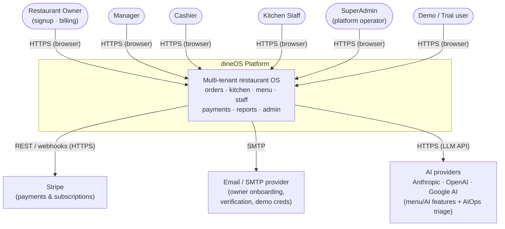
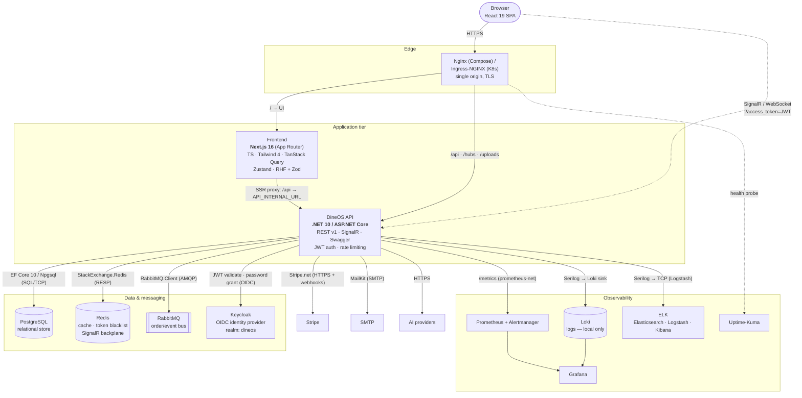
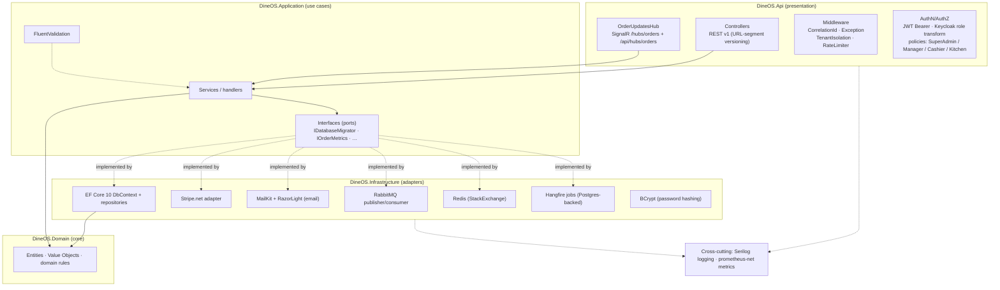
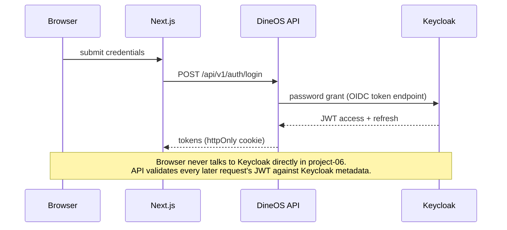
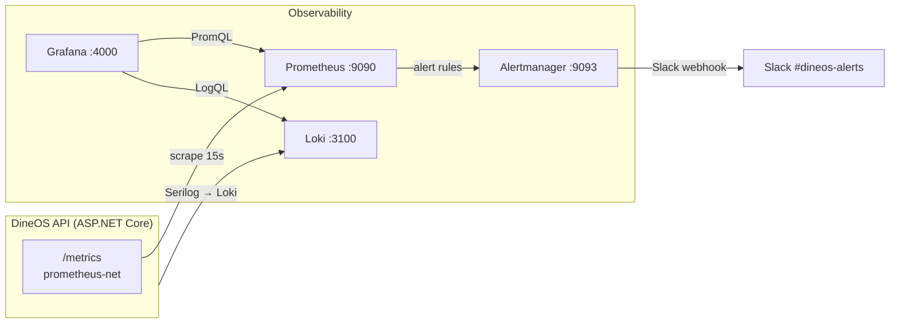
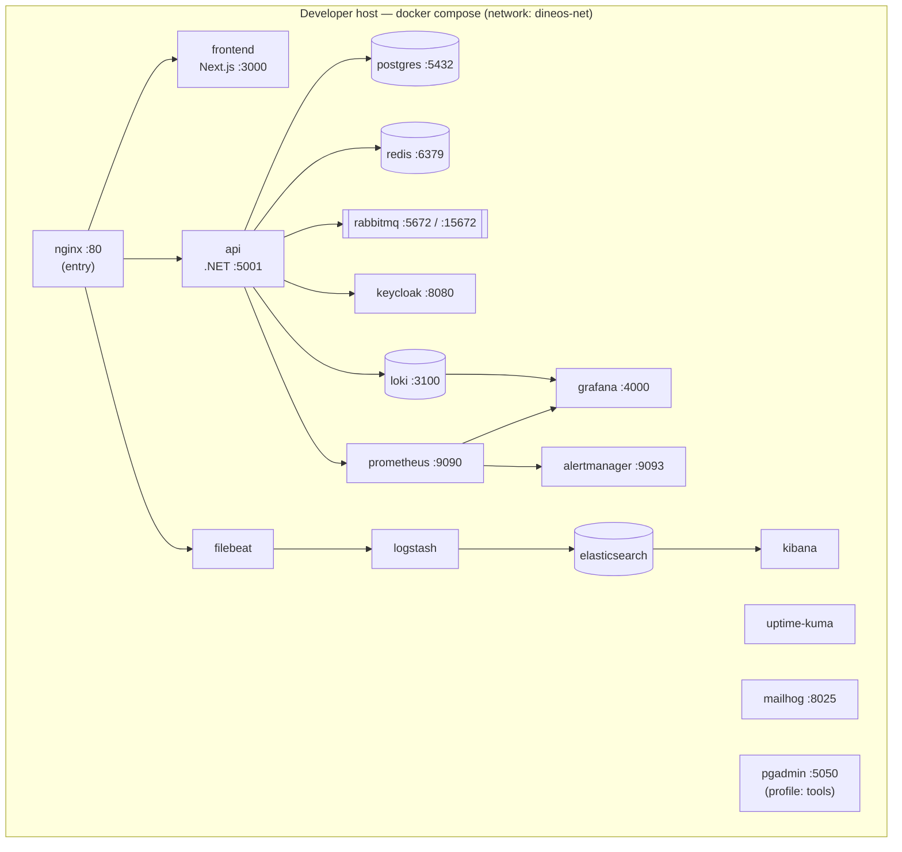
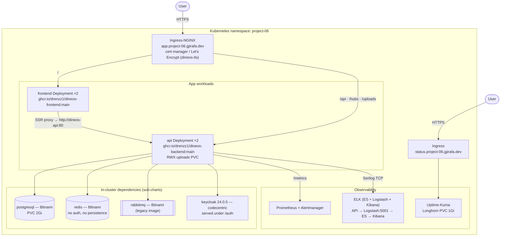
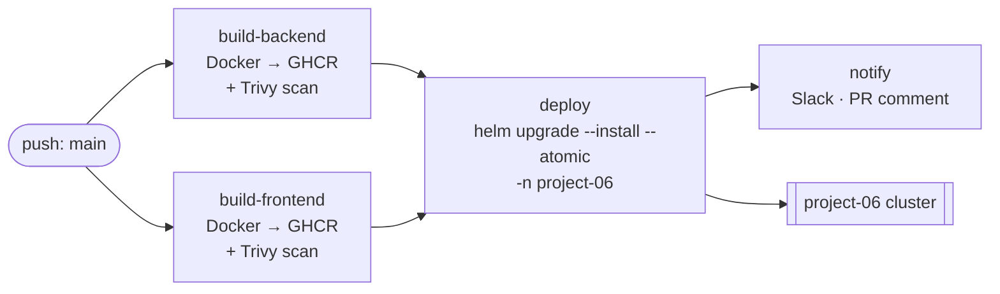

# dineOS — System Architecture

Complete, technology-labelled architecture for the dineOS restaurant-management
platform, documented with the [C4 model](https://c4model.com/) (Context →
Container → Component) plus two **deployment views** (local Docker Compose and
the live `project-06` Kubernetes cluster).

Every box is labelled with its concrete technology and the protocol on each
edge. The rationale for each major choice is recorded separately in
**[decisions.md](decisions.md)** (one row per decision: what / why / alternative
rejected / trade-off).

> **Scope note — this reflects what is actually running, not an ideal.** Where
> the local and deployed environments differ (e.g. Loki is present locally but
> not in the Helm chart), both are shown and the difference is called out. See
> [Environment differences](#environment-differences).

---

## C4 Level 1 — System Context

Who uses dineOS and which external systems it depends on.

| Actor / System | Interaction |
|---|---|
| Owner / Manager / Cashier / Kitchen Staff / SuperAdmin / Demo | Use the web app over HTTPS; role determines what they can see and do (RBAC). |
| **Stripe** | Subscription billing; inbound webhooks provision the owner's tenant. |
| **Email / SMTP** | Transactional mail — owner email verification, first-login link, emailed demo credentials. |
| **AI providers** | Optional LLM calls for product AI features and for the AIOps alert-triage flow. Degrade gracefully when no key is set. |

---

## C4 Level 2 — Container Diagram

The runnable units and the technology + protocol on every connection. (Keycloak,
Postgres, Redis and RabbitMQ are self-hosted containers here; they also appear in
the deployment views.)

### Connection legend

| Edge | Technology / protocol |
|---|---|
| Browser → Edge | HTTPS (single public origin) |
| Edge → Frontend | HTTP reverse-proxy, path `/` |
| Edge → API | HTTP reverse-proxy, paths `/api`, `/hubs`, `/uploads` |
| Browser ⇢ API (realtime) | SignalR over WebSocket; JWT passed as `?access_token=` (browsers can't set auth headers on WS) |
| Frontend → API (SSR) | Next.js rewrite `/api` → `API_INTERNAL_URL` (server-side proxy) |
| API → PostgreSQL | EF Core 10 + Npgsql, SQL over TCP |
| API → Redis | StackExchange.Redis (RESP) — refresh-token blacklist + SignalR backplane |
| API → RabbitMQ | RabbitMQ.Client (AMQP) — order-created notifications |
| API → Keycloak | OIDC: JWT bearer validation + password-grant login proxy |
| API → Stripe | Stripe.net SDK (HTTPS) + inbound webhooks |
| API → SMTP | MailKit; templates rendered with RazorLight |
| API → Prometheus | `/metrics` exposed via prometheus-net, scraped every 15 s |
| API → Loki / ELK | Serilog sinks (Loki HTTP locally; TCP/JSON → Logstash when enabled) |

---

## C4 Level 3 — Backend Components (Clean Architecture)

The API follows a strict 4-layer dependency rule: dependencies point **inward**
only (`Api → Application → Infrastructure → Domain`; Domain depends on nothing).

**Layer responsibilities**

| Layer | Project | Holds |
|---|---|---|
| Presentation | `DineOS.Api` | Controllers, SignalR hub, middleware pipeline, JWT auth + authorization policies, Swagger, rate limiting |
| Use cases | `DineOS.Application` | Application services, FluentValidation validators, port interfaces, options |
| Adapters | `DineOS.Infrastructure` | EF Core DbContext + repositories, Stripe / MailKit / RabbitMQ / Redis adapters, Hangfire jobs, BCrypt |
| Core | `DineOS.Domain` | Entities, value objects, invariants — no external dependencies |

---

## Key runtime flows

### Authentication (login)

### Real-time order updates

`Browser →(WebSocket, ?access_token=JWT)→ API SignalR hub`. Redis acts as the
**backplane** so any API replica can broadcast to clients connected to any other
replica. New-order events also flow through RabbitMQ for kitchen-display
notifications.

### Observability (reused from `docs/devops/observability.md`)

---

## Deployment View A — Local (Docker Compose)

Source: root `docker-compose.yml`. Single bridge network `dineos-net`; Nginx is
the only published web entry point (`http://localhost`). 18 services total.

- **Dev-only services:** Mailhog (catches outbound mail), pgAdmin (`--profile tools`), Filebeat (ships Nginx access logs into ELK).
- Images are built locally; `NEXT_PUBLIC_API_URL` is baked into the frontend image at build time.

---

## Deployment View B — `project-06` (Kubernetes via Helm)

Source: `deploy/helm/dineos` + `values.project-06.yaml`. Namespace `project-06`
on the shared school cluster. Public single-origin web app with Let's Encrypt
TLS. **Images auto-built and deployed from `main` on every merge** (see CI/CD).

**Notable project-06 specifics (all in `values.project-06.yaml`):**

- All four backing services run **in-cluster** (no managed cloud services) — though the chart supports pointing at external managed services via `dependencies.<name>.enabled=false` + `host`.
- API runs `ASPNETCORE_ENVIRONMENT=Development` for the demo; login uses the **password grant via the backend**, so the browser never calls Keycloak directly.
- Grafana is deployed **standalone** (`deploy/grafana-standalone.yaml`), outside the chart. **Loki is not deployed here** — `Loki__Uri` is set but unreachable; Serilog falls back to console/ELK.
- Uptime-Kuma has a public status page at `status.project-06.gjirafa.dev` (Longhorn-backed PVC so monitors survive restarts).

---

## CI/CD → deployment pipeline

The `deploy` job is gated by the GitHub **`production`** environment (optional
required-reviewer approval). If `KUBE_CONFIG_DATA` is absent it falls back to
`--dry-run`. See [docs/devops/cicd.md](../devops/cicd.md) for the full pipeline.

---

## Complete technology inventory

Every technology in the running system, where it runs, and what it does. (This
is the checklist behind the "every technology labelled" requirement.)

| Tier | Technology | Role | Local | project-06 |
|---|---|---|:--:|:--:|
| Frontend | Next.js 16 (App Router) | Web app + SSR proxy | ✅ | ✅ |
| Frontend | React 19 / TypeScript 5 | UI | ✅ | ✅ |
| Frontend | Tailwind CSS 4 | Styling | ✅ | ✅ |
| Frontend | TanStack Query | Server-state/data fetching | ✅ | ✅ |
| Frontend | Zustand | Client state | ✅ | ✅ |
| Frontend | React Hook Form + Zod | Forms + validation | ✅ | ✅ |
| Frontend | @microsoft/signalr | Realtime client | ✅ | ✅ |
| Frontend | Recharts / dnd-kit / Axios | Charts / drag-drop / HTTP | ✅ | ✅ |
| Backend | .NET 10 / ASP.NET Core | REST API + SignalR | ✅ | ✅ |
| Backend | EF Core 10 + Npgsql | ORM / data access | ✅ | ✅ |
| Backend | SignalR (+ Redis backplane) | Realtime order updates | ✅ | ✅ |
| Backend | JWT Bearer + Keycloak | AuthN/AuthZ (OIDC) | ✅ | ✅ |
| Backend | Hangfire (Postgres) | Background jobs | ✅ | ✅ |
| Backend | RabbitMQ.Client | Event/notification bus | ✅ | ✅ |
| Backend | Stripe.net | Billing | ✅ | ✅ |
| Backend | MailKit + RazorLight | Email | ✅ | (mail not exercised) |
| Backend | FluentValidation | Request validation | ✅ | ✅ |
| Backend | BCrypt.Net | Password hashing | ✅ | ✅ |
| Backend | Serilog | Structured logging | ✅ | ✅ |
| Backend | prometheus-net | Metrics | ✅ | ✅ |
| Backend | Swashbuckle | Swagger/OpenAPI | ✅ | (disabled in ingress) |
| Backend | Asp.Versioning | URL API versioning | ✅ | ✅ |
| Data | PostgreSQL | Primary store | ✅ | ✅ (Bitnami) |
| Data | Redis | Cache / blacklist / backplane | ✅ | ✅ (Bitnami) |
| Messaging | RabbitMQ | Async events | ✅ | ✅ (Bitnami legacy) |
| Identity | Keycloak | OIDC IdP, realm `dineos` | ✅ | ✅ (codecentric 24.0.5) |
| Observability | Prometheus + Alertmanager | Metrics + alerting | ✅ | ✅ |
| Observability | Grafana | Dashboards | ✅ | ✅ (standalone) |
| Observability | Loki | Log aggregation | ✅ | ❌ (not deployed) |
| Observability | ELK (ES + Logstash + Kibana) | Centralized log search | ✅ | ✅ |
| Observability | Filebeat | Nginx access-log shipper | ✅ | ❌ |
| Observability | Uptime-Kuma | Uptime + status page | ✅ | ✅ |
| Edge | Nginx | Reverse proxy (single origin) | ✅ | — |
| Edge | Ingress-NGINX + cert-manager | Ingress + TLS | — | ✅ |
| Dev tools | Mailhog | Mail catcher | ✅ | ❌ |
| Dev tools | pgAdmin | DB UI | ✅ (profile) | ❌ |
| Platform | Docker Compose | Local orchestration | ✅ | — |
| Platform | Helm + Kubernetes | Deployment | — | ✅ |
| Platform | GitHub Actions + GHCR | CI/CD + registry | ✅ | ✅ |
| Platform | Trivy | Image/fs vulnerability scan | ✅ | ✅ |

---

## Build & quality tooling (dev-time)

These technologies are not part of the running system, so they are intentionally
absent from the runtime diagrams above — but they are part of the project's
overall technology set and are listed here for completeness.

| Area | Technology | Role |
|---|---|---|
| Frontend unit/component tests | **Jest** + **ts-jest** + jest-environment-jsdom | Test runner |
| Frontend component testing | **React Testing Library** (`@testing-library/react` · `dom` · `jest-dom` · `user-event`) | Component/DOM assertions |
| Frontend HTTP mocking | axios-mock-adapter | Mock API client in tests |
| End-to-end / browser tests | **Playwright** (`@playwright/test`) | E2E flows |
| Accessibility tests | **`@axe-core/playwright`** | Automated a11y checks |
| Frontend lint | **ESLint** + `eslint-config-next` | Static analysis |
| Bundle analysis | `@next/bundle-analyzer` | Bundle-size reports |
| Backend tests | **xUnit** (`xunit` · `xunit.runner.visualstudio`) + `Microsoft.NET.Test.Sdk` | Test runner |
| Backend integration host | `Microsoft.AspNetCore.Mvc.Testing` | In-memory API test server |
| Backend test doubles | **NSubstitute** (+ analyzers) | Mocking |
| Backend test data | **Testcontainers** (`PostgreSql`, `Keycloak`) + EF Core InMemory | Real-dependency + in-memory test DBs |
| Backend coverage | **coverlet** (collector + msbuild) | 70 % coverage gate in CI |
| Convention enforcement | `Microsoft.CodeAnalysis.CSharp` (Roslyn) | "No magic role-string" guard tests |
| Commit hygiene | **commitlint** (`commitlint.config.js`) | Conventional Commits enforcement on PRs |
| Versioning / releases | **Release Please** (`release-please-config.json`) | Automated semver, changelog, GitHub releases |
| Language tooling | **TypeScript 5** · ts-node · cross-env | Build/type-check |

> CI/CD (GitHub Actions), the GHCR registry, and Trivy scanning appear in the
> runtime inventory above because they directly produce and gate the deployed
> artifacts.

---

## Environment differences

The single most important honesty point for this architecture: **local and
deployed are not identical.** A reader of either diagram alone would be misled
without this table.

| Aspect | Local (Compose) | project-06 (K8s) |
|---|---|---|
| Logs | Loki **and** ELK | ELK only (Loki URI set but not deployed) |
| Grafana | In the compose stack | Standalone manifest, outside the chart |
| Edge | Nginx container | Ingress-NGINX + cert-manager TLS |
| Backing services | In-stack containers | In-cluster sub-charts (can be swapped for managed via flags) |
| TLS | None (`http://localhost`) | Let's Encrypt on `app.project-06.gjirafa.dev` |
| Dev tools | Mailhog, pgAdmin, Filebeat | None |
| Images | Built locally | `ghcr.io/drenzz1/...:main`, auto-deployed from `main` |

---

## See also

- **[decisions.md](decisions.md)** — why each technology was chosen (the "every decision justified" deliverable).
- [docs/devops/compose.md](../devops/compose.md) — local environment reference.
- [docs/devops/helm.md](../devops/helm.md) — Helm chart reference.
- [docs/devops/observability.md](../devops/observability.md) — metrics, alerts, dashboards.
- [docs/devops/cicd.md](../devops/cicd.md) — CI/CD pipeline.
- [docs/devops/security.md](../devops/security.md) — security hardening.
