# DineOS — Database ERD

This diagram reflects the EF Core model in
[`AppDbContext`](../../backend/src/DineOS.Infrastructure/Persistence/AppDbContext.cs)
and the latest migration snapshot
[`AppDbContextModelSnapshot.cs`](../../backend/src/DineOS.Infrastructure/Persistence/Migrations/AppDbContextModelSnapshot.cs).

The DBMS is **PostgreSQL** (Npgsql provider). All primary keys are `bigint`
identity columns (`GENERATED BY DEFAULT AS IDENTITY`). The notation is
**crow's foot** (Mermaid `erDiagram`).

## Conventions used in the diagram

- **Solid line (`||--o{`)** — a real foreign-key constraint enforced by the database.
- **Dashed line (`}o..o{`)** — a *logical* reference: the column exists and is used
  by the application, but no FK constraint is generated (see
  [Notes on relationships](#notes-on-relationships)).
- `audit` marks the six audit columns inherited from `BaseAuditingEntity`:
  `CreatedAt`, `CreatedBy`, `UpdatedAt`, `UpdatedBy`, `DeletedAt`, `DeletedBy`.
- `TenantId` is present on every tenant-scoped entity and is used for row-level
  tenant filtering via an EF Core global query filter.

## ERD

```mermaid
erDiagram
    Tenants ||--o{ StaffMembers      : "owns (logical)"
    Tenants ||--o{ Orders            : "owns (logical)"
    Tenants ||--o{ OrderItems        : "owns (logical)"
    Tenants ||--o{ Payments          : "owns (logical)"
    Tenants ||--o{ MenuCategories    : "owns (logical)"
    Tenants ||--o{ MenuItems         : "owns (logical)"
    Tenants ||--o{ ShiftNotes        : "owns (logical)"
    Tenants ||--o{ RestaurantTables  : "owns (logical)"
    Tenants ||--o{ Shifts            : "owns (logical)"
    Tenants ||--o{ TenantInvoices    : "owns (logical)"
    Tenants ||--o{ EmailVerificationCodes : "owns (logical, nullable)"
    Tenants ||--o{ DeadLetterEmails   : "owns (logical, nullable)"
    Tenants ||--o{ ProcessedMessages  : "owns (logical)"
    Tenants ||--o{ DemoUsers           : "owns (logical, nullable)"

    Orders         ||--o{ OrderItems  : "Items (FK, cascade)"
    StaffMembers   ||--o{ Shifts      : "Shifts (FK, cascade)"
    MenuCategories ||--o{ MenuItems   : "Items (FK, restrict)"
    Orders         }o..o{ Payments    : "OrderId (logical)"

    Tenants {
        bigint   Id PK
        text     Name
        text     Slug
        boolean  IsActive
        text     OwnerName
        text     OwnerEmail
        text     Phone
        text     City
        integer  Plan "SubscriptionPlan enum"
        boolean  OwnerEmailVerified
        timestamp OwnerEmailVerifiedAt "nullable"
        text     StripeCustomerId "nullable, unique"
        text     StripeSubscriptionId "nullable, unique"
        text     StripeSessionId "nullable"
        integer  BillingStatus "BillingStatus enum"
        integer  BillingCycle "BillingCycle enum, nullable"
        timestamp CurrentPeriodEnd "nullable"
        text     KeycloakUserId "nullable"
        audit    audit_columns
    }

    StaffMembers {
        bigint   Id PK
        bigint   TenantId
        text     FullName
        text     Email
        text     Role
        text     PinHash
        boolean  IsActive
        audit    audit_columns
    }

    Orders {
        bigint   Id PK
        bigint   TenantId
        text     OrderType
        integer  TableNumber "nullable"
        integer  Status "OrderStatus enum"
        numeric  Total
        text     Notes "nullable"
        audit    audit_columns
    }

    OrderItems {
        bigint   Id PK
        bigint   TenantId
        bigint   OrderId FK
        text     Name
        integer  Quantity
        numeric  UnitPrice
        text     Notes "nullable"
        audit    audit_columns
    }

    Payments {
        bigint   Id PK
        bigint   TenantId
        bigint   OrderId "logical ref to Orders.Id"
        numeric  Amount
        integer  Method "PaymentMethod enum"
        integer  Status "PaymentStatus enum"
        timestamp OverdueNotifiedAt "nullable"
        audit    audit_columns
    }

    MenuCategories {
        bigint   Id PK
        bigint   TenantId
        text     Name
        audit    audit_columns
    }

    MenuItems {
        bigint   Id PK
        bigint   TenantId
        bigint   CategoryId FK "FK to MenuCategories.Id"
        text     Name
        numeric  Price
        text     Description "nullable"
        text     ImageUrl "nullable"
        audit    audit_columns
    }

    ShiftNotes {
        bigint   Id PK
        bigint   TenantId
        text     Title
        text     Body
        integer  Priority "ShiftNotePriority enum"
        text     Author
        audit    audit_columns
    }

    RestaurantTables {
        bigint   Id PK
        bigint   TenantId
        integer  Number
        integer  Capacity
        text     Location "nullable"
        boolean  IsActive
        audit    audit_columns
    }

    Shifts {
        bigint    Id PK
        bigint    TenantId
        bigint    StaffMemberId FK
        timestamp StartTime
        timestamp EndTime
        text      Notes "nullable"
        audit     audit_columns
    }

    TenantInvoices {
        bigint   Id PK
        bigint   TenantId
        text     StripeInvoiceId "unique"
        numeric  Amount
        text     Currency
        text     Status
        timestamp PaidAt "nullable"
        text     HostedInvoiceUrl "nullable"
        audit    audit_columns
    }

    EmailVerificationCodes {
        bigint   Id PK
        text     Email
        integer  Purpose "EmailVerificationPurpose enum"
        text     CodeHash
        timestamp ExpiresAt
        timestamp ConsumedAt "nullable"
        integer  FailedAttempts
        bigint   TenantId "nullable"
        audit    audit_columns
    }

    DeadLetterEmails {
        bigint   Id PK
        text     ToAddress
        text     Subject
        text     Body
        text     JobId
        text     JobType
        integer  AttemptCount
        text     ExceptionDetails "nullable"
        timestamp FailedAt
        bigint   TenantId "nullable"
        audit    audit_columns
    }

    ProcessedMessages {
        text     MessageId PK
        text     MessageType
        bigint   TenantId
        timestamp ProcessedAt
    }

    DemoUsers {
        bigint    Id PK
        text      Email "unique"
        text      KeycloakUserId "nullable"
        timestamp RequestedAt
        timestamp ExpiresAt
        timestamp LastEmailSentAt "nullable"
        text      IpAddress "nullable"
        integer   Status "DemoUserStatus enum"
        audit     audit_columns
    }
```

## Notes on relationships

The model declares **three** real foreign keys:

| Child                  | Parent             | Column          | On delete  |
|------------------------|--------------------|-----------------|------------|
| `OrderItems.OrderId`   | `Orders.Id`        | `OrderId`       | `Cascade`  |
| `Shifts.StaffMemberId` | `StaffMembers.Id`  | `StaffMemberId` | `Cascade`  |
| `MenuItems.CategoryId` | `MenuCategories.Id`| `CategoryId`    | `Restrict` |

> `MenuItems.CategoryId` is the result of normalising the schema (M5.3): menu
> items previously stored the category as a free-text `Category` column that
> duplicated `MenuCategories.Name` with no referential integrity. The API still
> accepts/returns a category *name* — `MenuService.ResolveCategoryAsync` maps a
> name to this FK (get-or-create per tenant), so the change is invisible to
> callers. See [decisions](#normalization-3nf) below.

All other references are **logical** — the column exists but no FK constraint is
emitted:

- **`TenantId`** on every tenant-scoped table. The relationship is enforced
  through application code and the EF global query filter in `AppDbContext`,
  not through a DB constraint. This keeps the tenant filter cheap and lets the
  SuperAdmin path use `IgnoreQueryFilters()` cleanly.
- **`Payments.OrderId`** has no `.HasOne<Order>()` mapping today. The column is a
  `bigint` used by the application; adding a real FK is a tracked future task.

## Soft delete & tenant scoping

Every entity except `ProcessedMessages` inherits `BaseAuditingEntity` (audit
columns) and, where tenant-scoped, `TenantAuditingEntity` (audit + `TenantId`).
The DbContext installs a global query filter that:

1. excludes rows where `DeletedAt IS NOT NULL`, and
2. for tenant-scoped entities, restricts rows to `e.TenantId == currentTenantId`
   (unless tenant context is unset, e.g. SuperAdmin requests).

See `AppDbContext.BuildTenantSoftDeleteFilter` for the exact predicate.

## Inheritance summary

| Entity                   | Base                    | Tenant filter | Notes |
|--------------------------|-------------------------|---------------|-------|
| `Tenant`                 | `BaseAuditingEntity`    | no (global)   | the only globally-scoped business table |
| `StaffMember`            | `TenantAuditingEntity`  | yes           | |
| `Order`                  | `TenantAuditingEntity`  | yes           | |
| `OrderItem`              | `TenantAuditingEntity`  | yes           | |
| `Payment`                | `TenantAuditingEntity`  | yes           | |
| `MenuCategory`           | `TenantAuditingEntity`  | yes           | |
| `MenuItem`               | `TenantAuditingEntity`  | yes           | FK → `MenuCategory` |
| `ShiftNote`              | `TenantAuditingEntity`  | yes           | |
| `RestaurantTable`        | `TenantAuditingEntity`  | yes           | |
| `Shift`                  | `TenantAuditingEntity`  | yes           | FK → `StaffMember` |
| `TenantInvoice`          | `BaseAuditingEntity`    | no            | own `TenantId`; Stripe billing history |
| `EmailVerificationCode`  | `BaseAuditingEntity`    | no            | own nullable `TenantId`; owner onboarding |
| `DeadLetterEmail`        | `BaseAuditingEntity`    | no            | own nullable `TenantId`; failed-email queue |
| `ProcessedMessage`       | _(none)_                | no            | RabbitMQ idempotency; PK is `MessageId` (text), no audit/soft-delete |
| `DemoUser`               | `BaseAuditingEntity`    | no            | own `Email` (unique); demo-access flow (#216), 7-day TTL cleanup |

## Normalization (3NF)

The schema is normalised to **third normal form**. See
[`SCHEMA.md` → Normalization (3NF)](./SCHEMA.md#normalization-3nf) for the
table-by-table analysis, the two normalisation fixes applied in M5.3
(`MenuItem.CategoryId` FK; removal of the derived `Tenant` aggregate columns),
and the one intentional, documented denormalisation (`OrderItem` price/name
snapshot).
