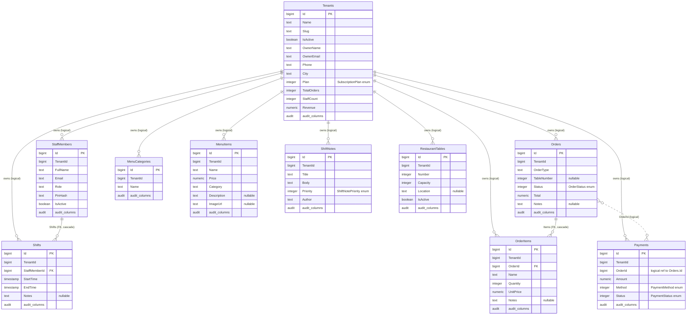

# DineOS — Database ERD

This diagram reflects the EF Core model in
[`AppDbContext`](../../backend/src/DineOS.Infrastructure/Persistence/AppDbContext.cs)
and the latest migration
[`AppDbContextModelSnapshot.cs`](../../backend/src/DineOS.Infrastructure/Persistence/Migrations/AppDbContextModelSnapshot.cs).

The DBMS is **PostgreSQL** (Npgsql provider). All primary keys are `bigint`
identity columns (`GENERATED BY DEFAULT AS IDENTITY`).

## Conventions used in the diagram

- **Solid line (`||--o{`)** — real foreign-key constraint enforced by the database.
- **Dashed line (`}o..o{`)** — logical reference: the column exists and is used by
  the application, but no FK constraint is generated (see
  [Notes on relationships](#notes-on-relationships)).
- `audit` marks the six audit columns inherited from `BaseAuditingEntity`:
  `CreatedAt`, `CreatedBy`, `UpdatedAt`, `UpdatedBy`, `DeletedAt`, `DeletedBy`.
- `TenantId` is present on every entity that inherits `TenantAuditingEntity`
  and is used for row-level tenant filtering via an EF Core global query filter.

## ERD

## Notes on relationships

The model currently declares **two** real foreign keys in
[`AppDbContextModelSnapshot.cs`](../../backend/src/DineOS.Infrastructure/Persistence/Migrations/AppDbContextModelSnapshot.cs):

| Child                | Parent         | Column         | On delete |
|----------------------|----------------|----------------|-----------|
| `OrderItems.OrderId` | `Orders.Id`    | `OrderId`      | `Cascade` |
| `Shifts.StaffMemberId` | `StaffMembers.Id` | `StaffMemberId` | `Cascade` |

All other references are **logical** — the column exists but no FK constraint
is emitted:

- **`TenantId`** on every tenant-scoped table. The relationship is enforced
  through application code and the EF global query filter in `AppDbContext`,
  not through a DB constraint. This keeps the tenant filter cheap and lets
  the SuperAdmin path use `IgnoreQueryFilters()` cleanly.
- **`Payments.OrderId`** has no `.HasOne<Order>()` mapping today. The column
  is a `bigint` and is used by the application; adding a real FK would be a
  pure schema-level improvement and is tracked as a future task.

## Soft delete & tenant scoping

Every entity in this diagram inherits `BaseAuditingEntity` (audit columns) and,
where applicable, `TenantAuditingEntity` (audit + `TenantId`). The DbContext
installs a global query filter that:

1. excludes rows where `DeletedAt IS NOT NULL`, and
2. for tenant-scoped entities, restricts rows to `e.TenantId == currentTenantId`
   (unless the current tenant is unset, e.g. SuperAdmin requests).

See `AppDbContext.BuildTenantSoftDeleteFilter` for the exact predicate.

## Inheritance summary

| Entity            | Base                    | Has `TenantId` |
|-------------------|-------------------------|----------------|
| `Tenant`          | `BaseAuditingEntity`    | no             |
| `StaffMember`     | `TenantAuditingEntity`  | yes            |
| `Order`           | `TenantAuditingEntity`  | yes            |
| `OrderItem`       | `TenantAuditingEntity`  | yes            |
| `Payment`         | `TenantAuditingEntity`  | yes            |
| `MenuCategory`    | `TenantAuditingEntity`  | yes            |
| `MenuItem`        | `TenantAuditingEntity`  | yes            |
| `ShiftNote`       | `TenantAuditingEntity`  | yes            |
| `RestaurantTable` | `TenantAuditingEntity`  | yes            |
| `Shift`           | `TenantAuditingEntity`  | yes            |

Only the `Tenant` table is global; every other table is tenant-scoped.
