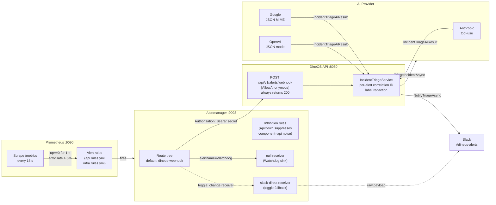

# AI-Powered Incident Triage (DO-12)

When Prometheus detects a service anomaly, Alertmanager delivers the alert to
the dineOS backend webhook.  The backend calls the configured AI provider
(Anthropic / OpenAI / Google), produces a structured triage — severity,
likely causes, suggested next actions, and a short summary — and posts a
rich Slack message with the result.  Every step is failure-isolated: an
unreachable AI provider or Slack failure is logged and swallowed; Alertmanager
always receives `200 OK` and never retries.

All commands are run from the **repo root** unless noted otherwise.

---

## Architecture



### Key design decisions

| Decision | Rationale |
|---|---|
| Always return 200 from the webhook | Alertmanager treats non-2xx as a delivery failure and retries indefinitely, flooding the pipeline. Errors are absorbed and logged. |
| Per-alert correlation ID | Each alert gets a `Guid.NewGuid().ToString("N")` ID so the triage log, AI call, and Slack post can be correlated across services in any log aggregator. |
| Label redaction before AI call | Sensitive label keys (`password`, `token`, `secret`, `apikey`, `connectionstring`, …) and long values that look like connection strings are replaced with `[REDACTED]` before the payload reaches the LLM. |
| Slack via `SlackNotifier`, not Alertmanager | Alertmanager posts raw payloads. The backend posts AI-enriched, structured Block Kit messages with severity colour, likely causes, and next actions. |
| `slack-direct` toggle | Keep the original Alertmanager → Slack path as a named receiver so it can be activated instantly (change `route.receiver`) without any code change — useful as a fallback if the API is unreachable. |
| `TenantIsolationMiddleware` bypass | The middleware already skips unauthenticated requests. `[AllowAnonymous]` on the controller is sufficient; no route exclusion is needed. |

---

## Configuration and secrets

### AI provider

At least one AI provider API key must be set; the active provider is chosen by `Ai:Provider`.

| Variable | .NET config key | Description |
|---|---|---|
| `Anthropic__ApiKey` | `Anthropic:ApiKey` | Anthropic API key (preferred) |
| `Anthropic__Model` | `Anthropic:Model` | Default: `claude-sonnet-4-5` |
| `OpenAI__ApiKey` | `OpenAI:ApiKey` | OpenAI API key |
| `GoogleAI__ApiKey` | `GoogleAI:ApiKey` | Google Gemini API key |

Set in `.env` (local) or as k8s Secrets (cluster).  Leave all blank to run
without AI triage — the webhook still returns `200` with empty results and
logs a warning per alert.

### Slack webhook

| Variable | Description |
|---|---|
| `SLACK_WEBHOOK_URL` | Incoming Webhook URL from api.slack.com/apps. Used by **both** the API's `SlackNotifier` and the `slack-direct` Alertmanager receiver. |

Map to the API container as `Slack__WebhookUrl=${SLACK_WEBHOOK_URL:-}` (already
wired in `docker-compose.yml`).  If empty, `SlackNotifier` logs a warning and
no-ops — all other pipeline stages continue normally.

### Triage shared secret

| Variable | Description |
|---|---|
| `ALERT_WEBHOOK_SECRET` | Shared secret for the webhook. Alertmanager sends it as `Authorization: Bearer`; the API also accepts `X-Webhook-Secret`. Must match on both Alertmanager and the API (`AlertWebhook:SharedSecret`). |

Alertmanager sends the secret as an `Authorization: Bearer` credential via
`http_config.authorization.credentials` (Alertmanager 0.28 does not support custom
`http_config.headers`).  The value is substituted into the config at startup by the
entrypoint (compose) / initContainer (Helm), since Alertmanager has no built-in
env-var expansion.  The API accepts the secret via either `Authorization: Bearer`
or `X-Webhook-Secret`.  Leave empty on a closed Docker or cluster network — the
endpoint is unauthenticated but only reachable within the internal network.

**Kubernetes**: create secrets and reference them in `values.yaml`:

```bash
# Slack webhook
kubectl create secret generic alertmanager-slack \
  --from-literal=url=https://hooks.slack.com/services/...

# Triage shared secret
kubectl create secret generic alertmanager-webhook \
  --from-literal=secret=<random-strong-value>
```

Then in `values.yaml`:
```yaml
observability:
  alertmanager:
    slackWebhookSecretName: alertmanager-slack
    alertWebhookSecretName: alertmanager-webhook
```

The `alertmanager-deployment.yaml` Helm template injects both as `SLACK_WEBHOOK_URL`
and `ALERT_WEBHOOK_SECRET` env vars on an initContainer, which substitutes them into
a runtime copy of the config before Alertmanager starts.

---

## Local demo

### Prerequisites

```bash
cp .env.example .env
# Edit .env: set at least one AI key + SLACK_WEBHOOK_URL (or leave blank for no-op)
docker compose up -d
```

### Fast demo (seconds)

Posts a synthetic `HighErrorRate` payload directly to the webhook.  No need to
wait for a real Prometheus alert rule to fire.

```bash
bash scripts/demo-do12.sh
```

Expected output:
1. API health check passes.
2. Sample payload POSTed; response shows `success: true`.
3. If an AI key is configured — triage results printed (severity, causes, next
   actions, correlation ID, model + token usage).
4. If `SLACK_WEBHOOK_URL` is set — `Slack notification sent` in logs.
5. PASS summary.

### Full pipeline demo (≈2 minutes)

Stops the API container so `ApiDown` fires through Prometheus → Alertmanager →
webhook, then restarts.

```bash
REAL_ALERT=true bash scripts/demo-do12.sh
```

### Live environment

```bash
API_BASE=https://app.project-06.gjirafa.dev/api bash scripts/demo-do12.sh
```

Docker log polling is skipped automatically.  Check Grafana/Loki or Kibana and
filter by the correlation IDs printed in the script output.

---

## Failure-path behavior

The pipeline is designed to degrade gracefully at every step.

| Failure | Behavior |
|---|---|
| AI provider unreachable / bad key | `AiUnavailableException` caught per-alert → `LogWarning` → alert skipped → empty result list → `200 OK` returned |
| AI provider returns unexpected response | `Exception` caught per-alert → `LogError` → same as above |
| Slack returns non-2xx | `LogWarning` with status code and body → no rethrow |
| Slack throws (network error) | `LogError` → no rethrow |
| `SlackNotifier` not configured | `LogWarning("Slack WebhookUrl is not configured")` → no-op |
| `IncidentTriageService` throws (unhandled) | Controller outer `try/catch` → `LogError` → `Ok(empty results)` → `200 OK` |
| Wrong / missing `X-Webhook-Secret` | Logged at `Warning` level → `200 OK` with `"Secret mismatch"` message → payload dropped |
| No `X-Webhook-Secret` configured | Anonymous access allowed → payload processed normally |

**Alertmanager always receives 200.**  It will not retry and will not page
on-call about a failed webhook delivery.

### Structured log fields

Every triage attempt emits structured Serilog events.  Search these fields in
Loki or Kibana:

| Event | Fields |
|---|---|
| Triage started | `CorrelationId`, `AlertName`, `Severity`, `Status` |
| Triage completed | `CorrelationId`, `AlertName`, `Severity`, `Provider` (model name), `InputTokens`, `OutputTokens`, `LatencyMs`, `Outcome=Success` |
| AI unavailable | `CorrelationId`, `AlertName`, `LatencyMs`, `Outcome=AiUnavailable` |
| Unexpected error | `CorrelationId`, `AlertName`, `LatencyMs`, `Outcome=Error` |
| Slack sent | `CorrelationId`, `AlertName` |
| Slack failed | `CorrelationId`, `AlertName`, `StatusCode`, response body |
| Secret mismatch | `RemoteIp` |

---

## Screenshots and log proof

> **TODO**: Attach evidence after the first successful end-to-end run.

| Artifact | Status |
|---|---|
| Demo script run output (PASS) | _pending_ |
| Slack message screenshot (Block Kit, AI summary) | _pending_ |
| Loki log screenshot filtered by CorrelationId | _pending_ |
| Kibana log screenshot filtered by CorrelationId | _pending_ |
| Alertmanager UI showing `dineos-webhook` receiver | _pending_ |

---

## Related documentation

- [Observability (Prometheus, Alertmanager, Grafana)](observability.md)
- [Prometheus alert rules and receiver config](../../backend/prometheus/README.md)
- [ELK centralized logging](elk.md)
- [Uptime Kuma synthetic monitoring](uptime-kuma.md)
