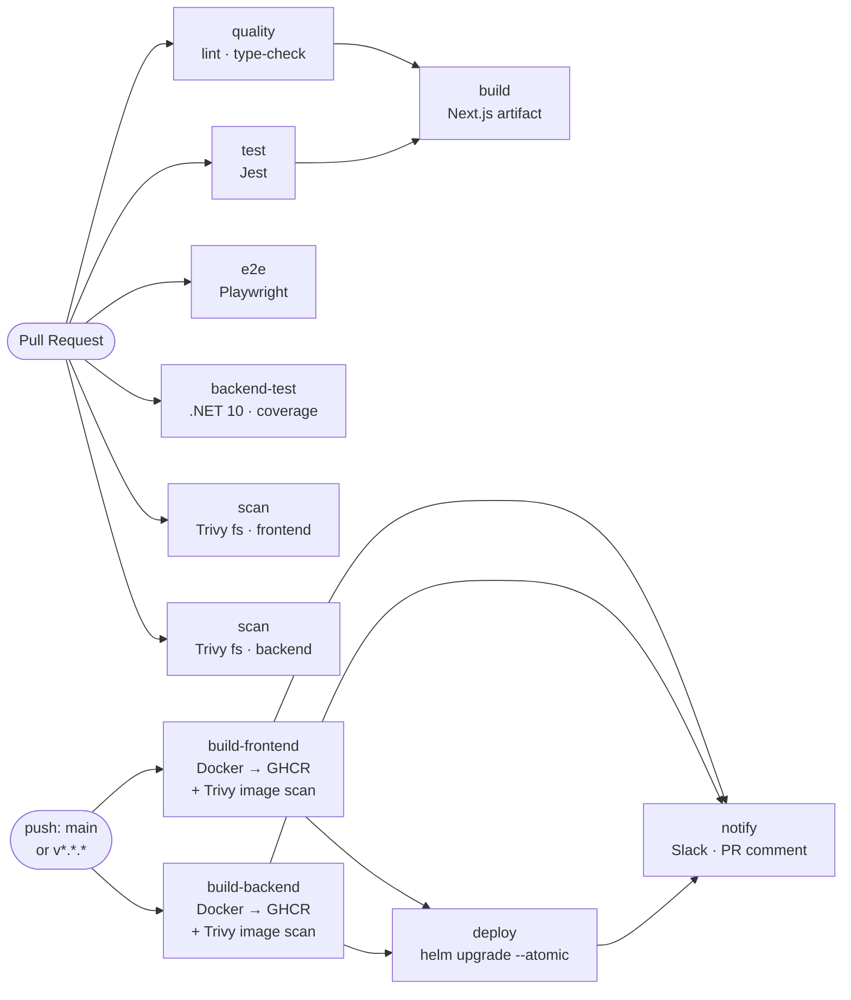

# CI/CD Pipeline

## Overview

dineOS uses six GitHub Actions workflows to go from a pull request to a running production deployment.

| Workflow | File | Trigger | Purpose |
|----------|------|---------|---------|
| Frontend CI | `.github/workflows/ci.yml` | push (all branches) + PR | Lint, type-check, Jest, Playwright, Next.js build artifact; **Trivy fs scan** (CRITICAL/HIGH, `frontend/`) |
| Backend CI | `.github/workflows/backend-ci.yml` | push / PR to `main` + `workflow_dispatch` | .NET 10 build, tests, 70 % coverage gate, live Keycloak tests; **Trivy fs scan** (CRITICAL/HIGH, `backend/`) |
| Helm CI | `.github/workflows/helm.yml` | push / PR on `deploy/helm/**` | Helm lint + kubeconform schema validation |
| Build & Push | `.github/workflows/build-push.yml` | push to `main`, `v*.*.*` tags, `workflow_dispatch` | Docker build → GHCR push → **Trivy image scan** (CRITICAL/HIGH, SARIF artifact) → Helm deploy → Slack notify |
| Commitlint | `.github/workflows/commitlint.yml` | PR | Validate all PR commits + PR title follow Conventional Commits |
| Release Please | `.github/workflows/release-please.yml` | push to `main` | Open release PR (bumps `version.txt`, updates `CHANGELOG.md`); on merge create `v*.*.*` tag + GitHub Release |

All commands in this document are run from the **repo root**.

---

## Pipeline Diagram



CI and CD are separate workflows. The left half runs on every push and pull request — `scan` jobs run in parallel with lint and tests, adding no extra wall-clock time. The right half runs only after a push to `main` or a semver tag; the Trivy image scan runs as a step inside each build job and blocks the `deploy` job if findings are found.

---

## Branch and Environment Gating

| Trigger | Workflows that run | Deploys? |
|---------|-------------------|---------|
| Any push or PR | `ci.yml`, `backend-ci.yml` | No |
| Push to `deploy/helm/**` | `helm.yml` | No |
| Push to `main` | `build-push.yml` | Yes — after both image builds succeed |
| Push a `v*.*.*` tag | `build-push.yml` | Yes — after both image builds succeed |
| `workflow_dispatch` on `build-push.yml` | `build-push.yml` | Yes (unless `KUBE_CONFIG_DATA` is absent — dry-run only) |

The `deploy` job is additionally gated by the **`production`** GitHub Environment. Configure required reviewers in the repo settings to require a manual approval before every deploy. See [Configuring the production environment](#configuring-the-production-environment).

---

## Image Tagging Scheme

Images are published to GitHub Container Registry under the repository owner:

| Image | GHCR path |
|-------|----------|
| Frontend (Next.js) | `ghcr.io/<owner>/dineos-frontend` |
| Backend (DineOS.Api) | `ghcr.io/<owner>/dineos-backend` |

Tags are derived by `docker/metadata-action@v5`:

| Trigger | Tags produced |
|---------|--------------|
| Push to `main` | `main`, `sha-<7-char>`, `latest` |
| Push `v1.2.3` tag | `1.2.3`, `1.2`, `sha-<7-char>`, `latest` |
| `workflow_dispatch` with `image_tag=hotfix-auth` | all of the above + `hotfix-auth` |

The `sha-<7-char>` tag is always produced regardless of trigger type. The `deploy` job uses it as the deterministic `--set *.image.tag` value so build and deploy reference the same image that was just pushed.

---

## Required Secrets

Set these in **Settings → Secrets and variables → Actions** on the GitHub repository.

| Secret | Required | Description |
|--------|----------|-------------|
| `GITHUB_TOKEN` | Automatic | Provided by GitHub Actions on every run. Grants `packages: write` for GHCR push and authenticates the `gh` CLI in the notify job. No setup required. |
| `KUBE_CONFIG_DATA` | Optional | base64-encoded kubeconfig for the production Kubernetes cluster. If absent the `deploy` job switches to `helm upgrade --dry-run` and emits a warning — no real deployment occurs. |
| `SLACK_WEBHOOK_URL` | Optional | Incoming Webhook URL for your Slack workspace. If absent the Slack notification step is skipped silently. |
| `NEXT_PUBLIC_API_URL` | Optional | Baked into the frontend Docker image at build time. If absent the Dockerfile ARG default (`http://localhost/api`) is used. Set before the first production image build. |
| `NEXT_PUBLIC_KEYCLOAK_URL` | Optional | Baked into the frontend image. Defaults to `http://localhost:8080`. |
| `NEXT_PUBLIC_KEYCLOAK_REALM` | Optional | Baked into the frontend image. Defaults to `dineos`. |

---

## Setting Up Secrets

Install the [GitHub CLI](https://cli.github.com/), authenticate with `gh auth login`, then run the commands below.

### KUBE_CONFIG_DATA

```bash
# Encode your kubeconfig and set the secret in one step
gh secret set KUBE_CONFIG_DATA \
  --body "$(base64 < ~/.kube/config | tr -d '\n')"
```

> If your kubeconfig contains multiple clusters, export only the relevant context to a separate file before encoding:
> ```bash
> kubectl config view --minify --flatten > /tmp/prod-kubeconfig.yaml
> gh secret set KUBE_CONFIG_DATA --body "$(base64 < /tmp/prod-kubeconfig.yaml | tr -d '\n')"
> ```

### SLACK_WEBHOOK_URL

```bash
gh secret set SLACK_WEBHOOK_URL --body "https://hooks.slack.com/services/T.../B.../..."
```

### Frontend build ARGs

These values are baked into the Next.js image — change them here when the production URLs change, then trigger a new build.

```bash
gh secret set NEXT_PUBLIC_API_URL        --body "https://app.dineos.io/api"
gh secret set NEXT_PUBLIC_KEYCLOAK_URL   --body "https://auth.dineos.io"
gh secret set NEXT_PUBLIC_KEYCLOAK_REALM --body "dineos"
```

---

## Manually Triggering a Build

The `build-push.yml` workflow supports `workflow_dispatch` with an optional `image_tag` override.

### From the GitHub UI

1. Open **Actions → Build & Push**.
2. Click **Run workflow**.
3. Select the branch (default: `main`).
4. Optionally enter an `image_tag` value (e.g. `hotfix-auth`). Leave blank to use the standard SHA and branch tags.
5. Click **Run workflow**.

### From the CLI

```bash
# Default tags (SHA + main + latest)
gh workflow run build-push.yml --ref main

# With a custom tag appended to the standard set
gh workflow run build-push.yml --ref main --field image_tag=hotfix-auth

# Watch the run in real time
gh run watch
```

---

## Configuring the Production Environment

The `deploy` job targets the GitHub Environment named **`production`**. Environments add required-reviewer gates and branch restrictions on top of the workflow `if:` condition.

### Initial setup

1. Open **Settings → Environments** on the GitHub repository.
2. Click **New environment**, name it `production`, and save.
3. Under **Deployment protection rules** enable **Required reviewers** and add the team members who must approve each deploy.
4. Under **Deployment branches** select **Selected branches** and add the patterns `main` and `v*.*.*`.
5. Save.

Once configured, every `deploy` job run will pause at the environment gate and wait for approval before executing `helm upgrade`.

> The environment URL is currently set to `https://dineos.example.com` in `.github/workflows/build-push.yml`. Replace this placeholder with the real production URL once it is known.

---

## Troubleshooting

### Slow builds — cache misses

**Frontend npm cache** is keyed on `frontend/package-lock.json`. If you see a fresh `npm ci` on every run, confirm `package-lock.json` is committed and that the `cache-dependency-path` in the workflow matches the file path.

**Backend NuGet cache** is keyed on all `.csproj` files under `backend/`. A cache miss on the first run after adding a new project is expected — the new package set differs.

**Docker layer cache** uses `type=gha` (GitHub Actions cache). The default limit is 10 GB per repository. If base layers are being re-downloaded, open **Actions → Management → Caches** and delete stale entries to free space.

---

### GHCR push — permission denied

```
denied: permission_denied: The token provided does not match expected scopes.
```

Check in order:

1. The workflow has `permissions: packages: write` at the top level of `build-push.yml`.
2. The `build-frontend` and `build-backend` jobs do not override `permissions` without including `packages: write`.
3. The repository's **Settings → Actions → General → Workflow permissions** is set to **Read and write permissions**, or the workflow explicitly grants `packages: write`.

> `GITHUB_TOKEN` on pull requests from forks never receives `packages: write` — image pushes on fork PRs will always fail. This is expected and secure.

---

### helm upgrade fails — ImagePullBackOff

```bash
kubectl describe pod -n dineos -l app.kubernetes.io/component=api
```

Look for `Failed to pull image` in the events section.

| Symptom | Likely cause | Fix |
|---------|-------------|-----|
| `manifest unknown` | SHA tag pushed by CI does not exist | Check the build-push job — a failed push leaves the registry incomplete. Re-run the workflow. |
| `unauthorized` | Cluster cannot authenticate to `ghcr.io` | Create an image pull secret and add it under `imagePullSecrets` in `values.yaml`. |
| Wrong image path | `github.repository_owner` differs between build and deploy | Verify the owner prefix in both the build and `--set *.image.repository` flags. |

---

### helm upgrade fails — timeout

```
Error: timed out waiting for the condition
```

`--atomic --timeout 5m` causes Helm to roll back when Pods are not ready within 5 minutes. This is almost always an application-level problem (bad readiness probe, missing secret, Keycloak unreachable).

```bash
# Which Pods are not Ready?
kubectl get pods -n dineos

# Stream application logs
kubectl logs -n dineos deployment/dineos-api --previous

# Event log for a stuck Pod
kubectl describe pod -n dineos -l app.kubernetes.io/component=api
```

The API readiness probe is `GET /api/v1/health` on port 8080. Check that all dependencies (PostgreSQL, Redis, Keycloak) are reachable from within the cluster namespace.

---

### Notify job — Slack message not delivered

If the Slack step is **silently skipped** (no error, no message): confirm `SLACK_WEBHOOK_URL` is set as a **repository-level** secret, not as an environment-level secret. Environment secrets are only available to jobs that target that environment — the `notify` job does not target `production`.

If the step **runs but fails** with a curl DNS error: the runner cannot reach `hooks.slack.com`. On self-hosted runners, ensure outbound HTTPS to `hooks.slack.com` is allowed in your network policy.
