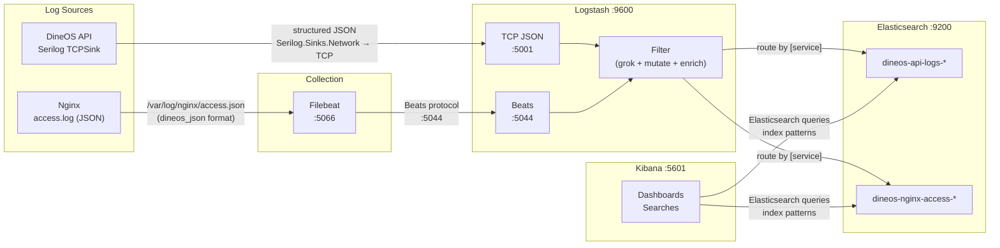

# ELK — Centralized Logging Stack

This document covers the Elasticsearch + Logstash + Kibana log-aggregation
stack for dineOS: how logs flow from sources through the pipeline, what indices
hold the data, what every parsed field means, and how to run the stack locally
or enable it in Kubernetes.

All commands are run from the **repo root** unless noted otherwise.

---

## Architecture



### Component responsibilities

| Component | Role |
|-----------|------|
| **Serilog TCPSink** | `Serilog.Sinks.Network` inside the .NET process — serialises structured log events as JSON lines and pushes them to Logstash over a raw TCP socket |
| **Nginx `dineos_json`** | Custom `log_format` defined in `infra/nginx/nginx.conf` — writes every request as a single JSON object to `/var/log/nginx/access.json` with a fixed field order |
| **Filebeat** | Tails `/var/log/nginx/access.json` from a shared Docker volume (`nginx_logs`) and ships each line to Logstash via the Beats protocol |
| **Logstash** | Ingests both streams (TCP :5001, Beats :5044), parses timestamps, normalises field names, enriches with GeoIP and user-agent data, and routes to the correct Elasticsearch index |
| **Elasticsearch** | Stores all logs in ILM-managed indices — `dineos-api-logs-*` for application events and `dineos-nginx-access-*` for HTTP access logs |
| **Kibana** | Visualisation layer — ships with two pre-built dashboards, four saved searches, and index patterns out of the box |

### Correlation model

Every request is traceable end-to-end through a single identifier:

1. **Nginx** generates `$request_id` (a unique UUID per connection)
2. The `X-Request-Id` proxy header passes it to the .NET API
3. Serilog's `CorrelationId` enricher picks it up and attaches it to every log event within that request scope
4. The Nginx access log records it as `http_x_request_id`

```
Browser → Nginx ($request_id) → API (CorrelationId)
            │                        │
            ▼                        ▼
   access.json                 Logstash :5001
   (http_x_request_id)         (CorrelationId)
            │                        │
            └────────┬───────────────┘
                     ▼
              Elasticsearch
         (join on both fields in Kibana)
```

---

## Indices & retention

### Index patterns

| Pattern | Source | Write alias | Documents per |
|----------|--------|-------------|---------------|
| `dineos-api-logs-YYYY.MM.dd` | Serilog → Logstash TCP :5001 | `dineos-api-logs` | API log event |
| `dineos-nginx-access-YYYY.MM.dd` | Nginx → Filebeat → Logstash Beats :5044 | `dineos-nginx-access` | HTTP request |

Logstash auto-creates daily indices via the date-suffix pattern `%{+YYYY.MM.dd}`
and attaches the ILM policy declared in the output plugin.

### ILM policy — `dineos-logs-ilm-7d`

Source: `backend/elk/elasticsearch/ilm/dineos-logs-ilm-7d.json`

| Phase | Trigger | Action |
|-------|---------|--------|
| **hot** | index creation | roll over after **1 day** or **5 GB** (whichever comes first) |
| **delete** | 7 days after rollover | permanently delete the index |

Total retention is approximately **8 days** from first write. For production,
increase `max_age` in the hot phase and `min_age` in the delete phase, or add a
`warm` phase with `forcemerge` and `shrink` actions before deletion.

### Index templates

Two composite index templates are registered at bootstrap time. They assign the
ILM policy and pre-define the field mapping types so Elasticsearch does not need
to guess types from the first ingested document.

| Template | Priority | Index pattern | Shards × replicas |
|----------|----------|---------------|-------------------|
| `dineos-api` | 100 | `dineos-api-logs-*` | 1 × 0 |
| `dineos-nginx` | 100 | `dineos-nginx-access-*` | 1 × 0 |

Single-shard, zero-replica is intentional for local and demo use. For production,
increase `number_of_replicas` to at least 1 for high-availability.

### Ports & environment variables

| Service | Host port | Variable | Default |
|---------|-----------|----------|---------|
| Elasticsearch | 9200 | `ES_PORT` | 9200 |
| Logstash Beats input | 5044 | — | — |
| Logstash TCP JSON input | 5001 | — | — |
| Logstash monitoring API | 9600 | — | — |
| Kibana | 5601 | `KIBANA_PORT` | 5601 |

Override `ES_PORT` and `KIBANA_PORT` in `.env` to avoid conflicts with other
services. The Logstash ports (5001, 5044, 9600) are not configurable via
environment variables — edit `docker-compose.yml` directly if needed.

> **Port conflict:** Logstash's TCP JSON input defaults to host port 5001, the
> same as `API_HTTP_PORT`. When running both the API and the ELK profile
> simultaneously, set `API_HTTP_PORT=5002` (or another free port) in `.env`.

---

## Field reference

### API logs — `dineos-api-logs-*`

Events originate from the .NET API via Serilog's `TCPSink` with
`JsonFormatter`. Logstash promotes `Properties.*` sub-fields to top level and
normalises `Level` → `level` (lowercase).

| Field | Type | Source | Description |
|-------|------|--------|-------------|
| `@timestamp` | `date` | Logstash `date` filter from `Timestamp` | When the log event was produced (ISO 8601) |
| `service` | `keyword` | Logstash `mutate add_field` | Always `dineos-api` |
| `level` | `keyword` | Serilog `Level`, lowercased by Logstash | `information`, `warning`, `error`, `debug`, `fatal` |
| `CorrelationId` | `keyword` | `Properties.CorrelationId` → top-level | Matches `http_x_request_id` in Nginx logs; trace a request across both indices |
| `UserId` | `keyword` | `Properties.UserId` → top-level | Authenticated user identity (Keycloak `sub` claim) |
| `TenantId` | `keyword` | `Properties.TenantId` → top-level | Multi-tenant discriminator (restaurant ID) |
| `StatusCode` | `keyword` | `Properties.StatusCode` → top-level | HTTP response status code (string to preserve `4xx` / `5xx` grouping) |
| `RequestPath` | `keyword` | `Properties.RequestPath` → top-level | Request path without query string |
| `RequestMethod` | `keyword` | `Properties.RequestMethod` → top-level | HTTP verb (`GET`, `POST`, `PUT`, `DELETE`, …) |
| `SourceContext` | `keyword` | `Properties.SourceContext` → top-level | Serilog source context — typically the fully-qualified class name |
| `Elapsed` | `long` | `Properties.Elapsed` → top-level | Request duration in milliseconds |
| `Message` | `text` | Serilog rendered message | Human-readable log message (free-text, not keyword-mapped) |
| `Exception` | `text` | Serilog exception renderer | Stack trace when available (free-text) |

### Nginx access logs — `dineos-nginx-access-*`

Events originate from Nginx's `dineos_json` log format, shipped by Filebeat.
Logstash grok-parses the JSON string, enriches with GeoIP and user-agent data,
and derives `request_time_ms` for histogram buckets.

| Field | Type | Source | Description |
|-------|------|--------|-------------|
| `@timestamp` | `date` | Logstash `date` filter from `time_iso8601` | When Nginx completed the request (ISO 8601) |
| `service` | `keyword` | Logstash `mutate add_field` | Always `dineos-nginx` |
| `remote_addr` | `ip` | Nginx `$remote_addr` | Client IP address — enables GeoIP enrichment and IP range filters |
| `request_method` | `keyword` | Nginx `$request_method` | HTTP verb |
| `request_uri` | `keyword` | Nginx `$request_uri` | Full URI path + query string |
| `status` | `keyword` | Nginx `$status`, converted from number | HTTP status code |
| `body_bytes_sent` | `long` | Nginx `$body_bytes_sent` | Response body size in bytes (excluding headers) |
| `request_time` | `float` | Nginx `$request_time` | Total request duration in **seconds** (e.g. `0.045` = 45 ms) |
| `request_time_ms` | `long` | Logstash `ruby` filter | Same duration in **milliseconds** — suitable for histogram bucket aggregations |
| `upstream_response_time` | `keyword` | Nginx `$upstream_response_time` | Time spent waiting for the upstream (API) response; `-` when no upstream was contacted |
| `http_referer` | `keyword` | Nginx `$http_referer` | HTTP Referer header |
| `http_user_agent` | `keyword` | Nginx `$http_user_agent` | Raw user-agent string; parsed by Logstash into `ua.*` |
| `http_x_request_id` | `keyword` | Nginx `$request_id` | Matches `CorrelationId` in API logs for end-to-end tracing |
| `geo.location` | `geo_point` | Logstash `geoip` filter | Latitude/longitude from IP geolocation (feed the geo map dashboard panel) |
| `geo.country_name` | `keyword` | Logstash `geoip` filter | Country name from GeoIP database |
| `geo.city_name` | `keyword` | Logstash `geoip` filter | City name from GeoIP database |
| `ua.name` | `keyword` | Logstash `useragent` filter | Browser or client name (e.g. `Chrome`, `Firefox`, `curl`) |
| `ua.os` | `keyword` | Logstash `useragent` filter | Operating system name |
| `ua.device` | `keyword` | Logstash `useragent` filter | Device type |

---

## Lifecycle commands

### Prerequisites

| Tool | Purpose |
|------|---------|
| Docker + Docker Compose | run the full stack |
| `bash` | bootstrap script |
| `curl` | healthcheck calls inside the script |

### 1. Start the ELK profile

The ELK stack is an **opt-in** Docker Compose profile. It does not start with
a plain `docker compose up -d` — it must be explicitly activated:

```bash
docker compose --profile elk up -d
```

Wait ~60 s for all containers to become healthy. Check:

```bash
docker compose ps
```

All `dineos-elasticsearch`, `dineos-logstash`, `dineos-kibana`, and
`dineos-filebeat` containers should show `healthy`.

### 2. Bootstrap Elasticsearch

The bootstrap script registers the ILM policy, index templates, write aliases,
and imports the pre-built Kibana saved objects (dashboards, searches, index
patterns). It is **idempotent** — safe to run multiple times.

```bash
bash backend/elk/setup/bootstrap.sh
```

Expected output:

```
=== DineOS ELK bootstrap ===
    Target : http://localhost:9200

Waiting for Elasticsearch...
  ✓ Elasticsearch is ready

1/4  ILM policy
  → dineos-logs-ilm-7d
  ✓ dineos-logs-ilm-7d  [HTTP 200]

2/4  Index templates
  → dineos-api index template
  ✓ dineos-api index template  [HTTP 200]
  → dineos-nginx index template
  ✓ dineos-nginx index template  [HTTP 200]

3/4  Write aliases
  → creating bootstrap index dineos-api-logs-000001 ...
  ✓ dineos-api-logs-000001  [HTTP 200]
  → creating bootstrap index dineos-nginx-access-000001 ...
  ✓ dineos-nginx-access-000001  [HTTP 200]

4/4  Kibana saved objects
  Waiting for Kibana...
  ✓ Kibana is ready
  → Importing saved objects (index patterns, searches, visualizations, dashboards)
  ✓ Kibana saved objects imported  [HTTP 200]

=== Bootstrap complete ===

  Kibana         : http://localhost:5601
  Elasticsearch  : http://localhost:9200
```

On subsequent runs, the alias step is skipped (aliases already exist) and the
Kibana import overwrites existing objects with `overwrite=true`.

### 3. Open Kibana

```
http://localhost:5601
```

Navigate to **Analytics → Dashboards**. The two pre-built dashboards are ready:

| Dashboard | Panels |
|-----------|--------|
| **DineOS API Logs** | Status code histogram, top request paths, error rate over time, top exceptions (SourceContext) |
| **DineOS Nginx Access** | Status code histogram, top request URIs (avg + p95), geo map (client IP), p95 latency by path |

### 4. Verify log flow

Send a request to the API and confirm it appears in Kibana:

```bash
# Hit a public endpoint
curl -s http://localhost:${API_HTTP_PORT:-5000}/api/v1/health | head -c 200

# Wait ~5 s, then check the API dashboard in Kibana.
# Or query Elasticsearch directly:
curl -s "http://localhost:${ES_PORT:-9200}/dineos-api-logs-*/_search?size=1&sort=@timestamp:desc" | python3 -m json.tool
```

Nginx access logs appear automatically — every HTTP request that passes through
the reverse proxy is written to `access.json` and picked up by Filebeat.

### 5. Cleanup

Stop and remove all ELK containers, volumes, and networks:

```bash
docker compose --profile elk down -v
```

The `-v` flag removes the `elasticsearch_data` and `nginx_logs` named volumes.
Without `-v`, index data and access logs persist across restarts and can be
reused on the next `docker compose --profile elk up -d`.

### Override the Elasticsearch host (non-localhost)

When running bootstrap from inside a container or a remote host:

```bash
ES_HOST=http://elasticsearch:9200 bash backend/elk/setup/bootstrap.sh
```

Override the Kibana URL:

```bash
KIBANA_URL=http://kibana:5601 bash backend/elk/setup/bootstrap.sh
```

---

## Enabling in Kubernetes

The Helm chart ships all ELK templates disabled by default
(`observability.elk.enabled: false`). Enable them when the cluster has
appropriate storage and networking policies.

### Enable the full ELK stack

```bash
helm upgrade --install dineos deploy/helm/dineos \
  --set observability.elk.enabled=true
```

This renders:

- `<release>-dineos-elasticsearch-headless` headless Service + `<release>-dineos-elasticsearch` ClusterIP Service
- `<release>-dineos-elasticsearch` StatefulSet (1 replica, persistent volume via `volumeClaimTemplates`)
- `<release>-dineos-logstash-config` ConfigMap (`logstash.yml`)
- `<release>-dineos-logstash-pipeline` ConfigMap (`dineos.conf`, rendered via Helm `tpl`)
- `<release>-dineos-logstash` Deployment + ClusterIP Service (ports 5001, 5044, 9600)
- `<release>-dineos-kibana` Deployment + ClusterIP Service (port 5601)

When ELK is enabled, the API ConfigMap automatically wires `Logstash__Uri` to
`http://<release>-dineos-logstash:5001` — no manual configuration required.

### Expose Kibana

Enable the optional Kibana Ingress:

```bash
helm upgrade dineos deploy/helm/dineos \
  --set observability.elk.enabled=true \
  --set observability.elk.kibana.ingress.enabled=true \
  --set observability.elk.kibana.ingress.host=kibana.dineos.io
```

The Ingress uses cert-manager for TLS and the cluster's `nginx` ingress
controller. Override `clusterIssuer` and `tls.secretName` as needed.

### Tune persistence and resources

```bash
helm upgrade dineos deploy/helm/dineos \
  --set observability.elk.enabled=true \
  --set observability.elk.elasticsearch.persistence.size=50Gi \
  --set observability.elk.elasticsearch.resources.requests.memory=2Gi \
  --set observability.elk.elasticsearch.resources.limits.memory=4Gi \
  --set observability.elk.ilm.deleteAfter=30d
```

The `ilm.deleteAfter` value is informational (recorded in `values.yaml`) —
the actual ILM policy must be registered separately via the bootstrap flow or
an init container.

### Verify the deployment

```bash
# Elasticsearch
kubectl port-forward svc/<release>-dineos-elasticsearch 9200:9200 -n dineos
# → curl http://localhost:9200/_cluster/health

# Kibana
kubectl port-forward svc/<release>-dineos-kibana 5601:5600 -n dineos
# → open http://localhost:5601
```

> **Note:** The Kibana saved objects (index patterns, searches, visualizations,
> dashboards) defined in `backend/elk/kibana/saved-objects.ndjson` must be
> imported manually after the K8s ELK stack is running. The bootstrap script
> targets `localhost:5601` by default. Port-forward Kibana first, then run:
>
> ```bash
> KIBANA_URL=http://localhost:5601 bash backend/elk/setup/bootstrap.sh
> ```
>
> A future automation (init container or ConfigMap-backed provisioning) may
> remove this manual step.

---

## Troubleshooting

### Elasticsearch stays "yellow" on a single-node cluster

A yellow cluster health on a single-node cluster means unassigned replica
shards. The index templates in `backend/elk/elasticsearch/index-templates/`
set `number_of_replicas: 0` — confirm they were applied:

```bash
curl -s http://localhost:9200/_index_template/dineos-api | python3 -m json.tool | grep number_of_replicas
curl -s http://localhost:9200/_index_template/dineos-nginx | python3 -m json.tool | grep number_of_replicas
```

If an index was created before the template was registered (e.g. Logstash wrote
to it during a test run before bootstrap), update the existing index settings:

```bash
curl -X PUT "http://localhost:9200/dineos-api-logs-*/_settings" \
  -H "Content-Type: application/json" \
  -d '{"index":{"number_of_replicas":0}}'

curl -X PUT "http://localhost:9200/dineos-nginx-access-*/_settings" \
  -H "Content-Type: application/json" \
  -d '{"index":{"number_of_replicas":0}}'
```

Cluster health should turn green within a few seconds.

### `vm.max_map_count` too low (Linux hosts)

Elasticsearch requires a higher virtual memory map count than the Linux default
(65530). If the container exits immediately with a bootstrap check error:

```
max virtual memory areas vm.max_map_count [65530] is too low, increase to at least [262144]
```

Fix on the **host** (Docker Desktop / WSL2 / native Linux):

```bash
# Temporary (lost on reboot)
sudo sysctl -w vm.max_map_count=262144

# Permanent
echo "vm.max_map_count=262144" | sudo tee -a /etc/sysctl.conf
sudo sysctl -p
```

Then restart the ELK profile:

```bash
docker compose --profile elk restart elasticsearch
```

### Logstash pipeline not picking up changes

Logstash polls its pipeline directory (`/usr/share/logstash/pipeline/`) every
few seconds and auto-reloads when any `.conf` file changes. Check the reload
status:

```bash
curl -s http://localhost:9600/_node/pipelines?pretty
```

If the pipeline shows `"status": "error"`, inspect the Logstash logs for a
syntax error:

```bash
docker compose logs logstash --tail=50
```

To force a reload without restarting the container:

```bash
# Kill the Logstash process — Docker will restart it (restart: unless-stopped)
docker compose --profile elk kill -s SIGHUP logstash
```

### "No shipper logs in Kibana" — runbook

When you expect data in Kibana but see nothing, work through the pipeline
bottom-up to find where logs are being dropped.

#### 1. Confirm Elasticsearch has data

```bash
# Count documents across all API indices
curl -s "http://localhost:9200/dineos-api-logs-*/_count" | python3 -m json.tool | grep count

# Count documents across all Nginx indices
curl -s "http://localhost:9200/dineos-nginx-access-*/_count" | python3 -m json.tool | grep count

# List all indices
curl -s "http://localhost:9200/_cat/indices/dineos-*?v"
```

If `count` is zero for both, the problem is upstream (step 2). If one pattern
has data but the other does not, the issue is in the specific pipeline branch
or shipper (step 2 or 3).

#### 2. Check Logstash — are inputs receiving data?

```bash
# Logstash pipeline stats (events in/out/filtered per plugin)
curl -s http://localhost:9600/_node/stats/pipelines?pretty | grep -A5 '"events"'

# Check Logstash logs for connection errors, grok failures, or ES rejects
docker compose logs logstash --tail=100
```

Look for:
- `"out": 0` on the `tcp` or `beats` input — no data is arriving
- `_grokparsefailure` tags in the log — the JSON format doesn't match the grok pattern
- `[403]` or `[404]` from the Elasticsearch output — index template missing or ILM policy not registered

#### 3. Check Filebeat — is it shipping Nginx logs?

```bash
# Filebeat internal metrics
curl -s http://localhost:5066/stats | python3 -m json.tool | grep -E '"events"|"harvesting"|"open_files"'

# Filebeat logs — look for "Harvester started" and "Events published"
docker compose logs filebeat --tail=50
```

Common Filebeat issues:
- **No harvesters running**: The `nginx_logs` volume isn't mounted or the
  `access.json` path inside the container is wrong. Verify:
  ```bash
  docker compose --profile elk exec filebeat ls -la /var/log/nginx/
  ```
- **Permission denied**: Filebeat runs as `root` (`user: root` in
  `docker-compose.yml`). If you changed this, Filebeat may not be able to read
  the volume.
- **Output blocked**: Filebeat waits for Logstash to be healthy. If Logstash
  is down, Filebeat buffers events in its internal queue until the output
  becomes available.

#### 4. Check the Nginx access log — is it being written to?

```bash
# The access log is a shared Docker volume — check it from the Nginx container
docker compose exec nginx tail -5 /var/log/nginx/access.json

# Generate a test request if the log is empty
curl -s -o /dev/null -w "%{http_code}" http://localhost/api/v1/health
```

If the access log is empty or stale:
- Confirm the `dineos_json` log format is loaded:
  ```bash
  docker compose exec nginx nginx -T 2>&1 | grep -A12 "log_format dineos_json"
  ```
- Confirm the `nginx_logs` volume is mounted:
  ```bash
  docker compose exec nginx ls -la /var/log/nginx/
  ```

#### 5. Check the API → Logstash TCP connection

```bash
# API logs — is the TCPSink configured?
docker compose logs api --tail=20 | grep -i "logstash\|tcp"

# Test the TCP connection manually
echo '{"Timestamp":"2024-01-01T00:00:00Z","Level":"Information","Message":"test"}' | nc -w 2 localhost 5001
```

If the API can't connect to Logstash:
- Verify `Logstash__Uri` is set in `.env` (should be `http://logstash:5001`)
- Confirm Logstash is listening:
  ```bash
  docker compose --profile elk exec logstash netstat -tlnp | grep -E "5001|5044"
  ```

### Kibana fails to start (stuck at "server is not ready")

Kibana requires Elasticsearch to be fully operational before its own startup
completes. Common causes:

| Symptom | Likely cause | Fix |
|---------|-------------|-----|
| `Kibana server is not ready yet` for > 2 min | ES is not healthy | `docker compose ps elasticsearch` — wait for `healthy` |
| `Unable to retrieve version information` | ES host wrong or unreachable | The `ELASTICSEARCH_HOSTS` env var in docker-compose.yml must be `http://elasticsearch:9200` |
| `Saved objects migration failed` | Leftover `.kibana_*` indices from a different version | Stop the stack, run `docker compose --profile elk down -v`, then restart |

---

## When to use ELK vs Loki / Grafana

Both ELK and Loki ingest structured logs from the DineOS API. They are
complementary and the stack runs both by default — the decision is about
*which tool answers which question*.

### Decision table

| Question | Use | Why |
|----------|-----|-----|
| Show me every log line for CorrelationId `abc123` | **Loki** | Free-text LogQL filter on a label — instant, zero cost |
| What is the p99 latency broken down by endpoint? | **Prometheus + Grafana** | `http_request_duration_seconds_bucket` histogram — designed for this |
| How many 5xx errors happened in the last hour? | **Either** | Loki: `{app="dineos-api"} \|= "500"`; ELK: count aggregation on `status >= 500` |
| Which countries are hitting the `/orders` endpoint? | **ELK** | GeoIP enrichment via Logstash produces `geo.country_name` — Loki cannot enrich at ingest |
| What browsers are users on when they see errors? | **ELK** | User-agent parsing produces `ua.name`, `ua.os`, `ua.device` — no equivalent in Loki |
| Show me the raw stack trace for this exception | **Loki** | Every Serilog event already flows to Loki — it is the path of least resistance |
| What is the 7-day trend of Nginx p95 latency by URI? | **ELK** | The `request_time_ms` field enables percentile aggregations over time — Elasticsearch aggregations are built for this |
| Correlate an API error with its Nginx access-log entry | **ELK** | Join on `CorrelationId == http_x_request_id` across two index patterns in a single Kibana dashboard |
| Ad-hoc full-text search across all log fields | **ELK** | Elasticsearch is a full-text search engine — Kibana Discover supports Lucene query syntax and field-level filtering |
| Alert on error rate > 5 % | **Prometheus + Alertmanager** | Metrics-based alerting with dedup, grouping, inhibition, and Slack routing — logs are the wrong primitive for alerting |

### Rule of thumb

| Layer | Tool |
|-------|------|
| **Metrics** (counters, histograms, gauges) | Prometheus → Grafana |
| **Cheap label-based log tailing** | Loki → Grafana |
| **Full-text search, ad-hoc analytics, Nginx access deep-dives** | ELK → Kibana |
| **Alerting** | Prometheus → Alertmanager → Slack |

### Data flow — how they coexist

```
API
 ├─ /metrics (prometheus-net) ──→ Prometheus ──→ Alertmanager ──→ Slack
 │                                      │
 │                                      └──→ Grafana (dashboards)
 │
 ├─ Serilog Loki sink ──→ Loki ──→ Grafana (log panels)
 │
 └─ Serilog TCPSink ──→ Logstash :5001 ──→ Elasticsearch ──→ Kibana
                                                   │
 Nginx access.json ──→ Filebeat ──→ Logstash :5044 ┘
```

All three paths are independent. Disabling one — e.g. omitting the `--profile elk`
flag or setting `Loki__Uri=""` — has no effect on the others.
