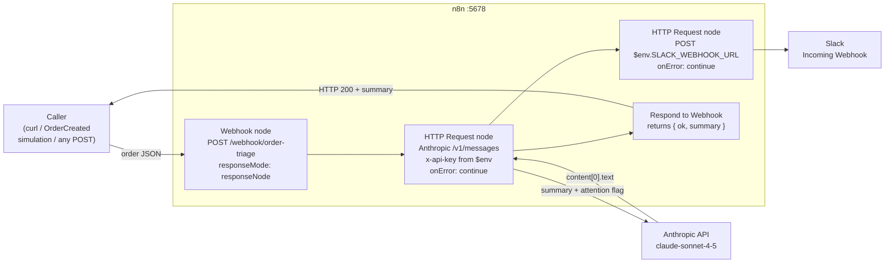

# n8n Workflow Automation (M5.8)

dineOS self-hosts [n8n](https://n8n.io) to satisfy the M5.8 deliverable: at least
one **webhook → LLM → notification** automation pipeline.  A `POST` to the n8n
webhook triggers an Anthropic LLM call that summarizes and flags an incoming
order, posts the result to Slack, and returns the summary in the HTTP response.

n8n runs as a container in the root `docker-compose.yml`, the same self-hosted
pattern used for Unleash (M5.6).  The pipeline reuses the **same secrets the API
already uses** (`Anthropic__ApiKey`, `Anthropic__Model`, `SLACK_WEBHOOK_URL`) —
no new credentials are required.

All commands are run from the **repo root** unless noted otherwise.

> **Relationship to DO-12.** The backend already implements a native
> webhook → LLM → Slack pipeline in code (the
> [AI-powered incident triage](aiops-triage.md), `POST /api/v1/alerts/webhook` →
> `IncidentTriageService` → `SlackNotifier`).  M5.8 specifically requires the
> pattern **using n8n**, so this is the low-level-code-free, GUI-defined
> equivalent — the workflow is the committed artifact, not C# services.

---

## Architecture



### Key design decisions

| Decision | Rationale |
|---|---|
| **HTTP Request node, not the native Anthropic/LangChain node** | Version-stable across n8n releases and self-documenting in the exported JSON. Reuses the existing `Anthropic__ApiKey` via `$env.ANTHROPIC_API_KEY` instead of an n8n credential, so the workflow imports and runs with zero GUI configuration. |
| **Reuse existing secrets** | `ANTHROPIC_API_KEY`, `ANTHROPIC_MODEL` and `SLACK_WEBHOOK_URL` are injected into the n8n container from the same `.env` values the API uses — no separate key management. |
| **Auto-import + auto-activate on startup** | The container entrypoint runs `n8n import:workflow` then `n8n update:workflow --all --active=true` before `n8n start`, so the production webhook is live immediately. Matches the "demo needs no manual setup" philosophy used for Unleash token seeding. |
| **`onError: continueRegularOutput` on the LLM + Slack nodes** | With no AI key (or an unreachable Slack), the webhook still returns `200` with an `"AI summary unavailable"` message rather than a `500`. The pipeline degrades gracefully, mirroring the DO-12 failure-isolation design. |
| **Stable workflow `id`** | The committed JSON pins `id: dineOSOrderTri01`, so re-import on container restart **updates** the workflow instead of creating duplicates. |
| **`responseMode: responseNode`** | A dedicated *Respond to Webhook* node returns the AI summary to the caller, which makes the pipeline verifiable from a single `curl` (see the demo script). |

---

## Configuration and secrets

All values are mapped into the `n8n` container in `docker-compose.yml` from `.env`.

| n8n env var | Sourced from `.env` | Purpose |
|---|---|---|
| `ANTHROPIC_API_KEY` | `Anthropic__ApiKey` | Auth for the Anthropic `/v1/messages` call. Blank → graceful "unavailable" message. |
| `ANTHROPIC_MODEL` | `Anthropic__Model` (default `claude-sonnet-4-5`) | Model used by the LLM node. |
| `SLACK_WEBHOOK_URL` | `SLACK_WEBHOOK_URL` | Slack Incoming Webhook — the **same** one DO-12 / Alertmanager use. Blank/placeholder → Slack post no-ops, pipeline continues. |
| `N8N_PORT` | `N8N_PORT` (default `5678`) | Host port for the editor + webhook. |
| `N8N_WEBHOOK_URL` | `N8N_WEBHOOK_URL` | Public base URL n8n uses to build production webhook URLs. |
| `N8N_ENCRYPTION_KEY` | `N8N_ENCRYPTION_KEY` | Fixed dev key so state survives restarts. **Set a strong random value for any shared instance and never commit it.** |

The workflow file lives at `deploy/n8n/workflows/order-triage.json` and is mounted
read-only into the container at `/demo-workflows`.

---

## Local demo

### Prerequisites

```bash
cp .env.example .env
# Edit .env:
#   • Anthropic__ApiKey  — set to run the full LLM pipeline (optional; degrades gracefully)
#   • SLACK_WEBHOOK_URL  — set to actually post to Slack (optional)
docker compose up -d n8n
```

n8n is ready when `docker compose ps n8n` shows `(healthy)` (~30 s on first boot).
Open the editor at **http://localhost:5678** to inspect the imported, active
**dineOS Order Triage** workflow.

### Fast demo (seconds)

Posts a synthetic order payload to the production webhook and prints the
LLM summary returned in the response.

```bash
bash scripts/demo-m58.sh
```

Expected output:
1. n8n health check passes.
2. Sample order POSTed to `http://localhost:5678/webhook/order-triage`.
3. Webhook responds `200` with `{ "ok": true, "summary": "<AI summary>" }`
   (or the graceful "AI summary unavailable" message if no key is set).
4. If `SLACK_WEBHOOK_URL` is set — the same summary appears in your Slack channel.
5. PASS summary.

### Manual call

```bash
curl -sS -X POST http://localhost:5678/webhook/order-triage \
  -H 'Content-Type: application/json' \
  -d '{
        "orderId": "ORD-1042",
        "table": 7,
        "items": [
          { "name": "Ribeye steak", "qty": 2, "notes": "one well-done, nut allergy" },
          { "name": "House red", "qty": 1 }
        ],
        "total": 86.50,
        "currency": "EUR"
      }'
```

---

## Wiring a real dineOS trigger (optional)

The backend already emits an `OrderCreated` RabbitMQ event
(see [`docs/backend/rabbitmq-event-flow.md`](../backend/rabbitmq-event-flow.md)).
To drive this pipeline from a real order rather than a manual `curl`, add a
consumer (or a small forwarder) that POSTs the order payload to
`http://n8n:5678/webhook/order-triage` on the `dineos-net` network.  This is left
as an opt-in extension to keep the deliverable's blast radius small — the
committed workflow + webhook is the verifiable artifact.

---

## Failure-path behavior

| Failure | Behavior |
|---|---|
| No `ANTHROPIC_API_KEY` set | LLM node errors → `onError: continueRegularOutput` → webhook returns `200` with `summary: "AI summary unavailable …"`; Slack receives the same fallback text. |
| Anthropic returns non-2xx | Same as above — node output carries the error, fallback message is used. |
| `SLACK_WEBHOOK_URL` blank / placeholder | Slack node errors and is swallowed; the pipeline still returns the summary to the caller. |
| n8n container restarted | Workflow is re-imported by `id` (updates, no duplicate) and re-activated; webhook comes back automatically. |

---

## Verification artifacts

> **TODO**: Attach evidence after the first successful end-to-end run with a live key.

| Artifact | Status |
|---|---|
| `docker compose config` validates the n8n service | ✅ |
| Workflow imports + activates on startup (CLI log) | ✅ |
| Webhook returns summary (demo script PASS) | _pending live key_ |
| Slack message screenshot (AI order summary) | _pending live key_ |
| n8n editor screenshot (active workflow) | _pending_ |

---

## Related documentation

- [AI-powered incident triage (DO-12)](aiops-triage.md) — the native in-code equivalent
- [Feature flags (Unleash, M5.6)](../backend/feature-flags.md) — the same self-hosted-service pattern
- [Compose environment](compose.md)
- [RabbitMQ event flow](../backend/rabbitmq-event-flow.md) — `OrderCreated`, a candidate real trigger
