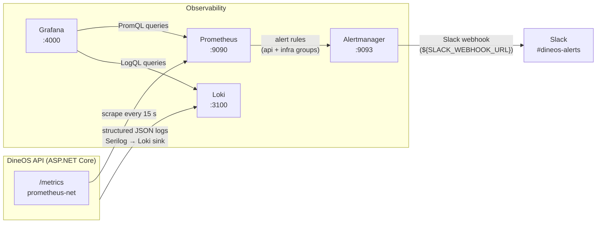

# Observability — Prometheus, Alertmanager & Grafana

This document covers the full observability stack for dineOS: what is measured,
how alerts are routed, and how to run the demo end-to-end locally or enable it
in Kubernetes.

All commands are run from the **repo root** unless noted otherwise.

---

## Architecture



### Component responsibilities

| Component | Role |
|-----------|------|
| **prometheus-net.AspNetCore** | Exposes `/metrics` from inside the .NET process — HTTP counters, latency histograms, GC pause time, thread-pool queue length |
| **Prometheus** | Scrapes `/metrics` every 15 s, evaluates alert rules, forwards firing alerts to Alertmanager |
| **Alertmanager** | Deduplicates, groups, and routes alerts; applies inhibition rules; sends Slack notifications |
| **Grafana** | Dashboards — queries Prometheus for metrics and Loki for logs side by side |
| **Loki** | Log aggregation — receives structured JSON from Serilog's Loki sink |

---

## Prometheus vs Loki — when to use which

| Question | Use |
|----------|-----|
| Is the error rate above 5 %? | **Prometheus** — `http_requests_received_total` counter |
| What is the p95 latency right now? | **Prometheus** — `http_request_duration_seconds_bucket` histogram |
| Which SQL query is slow? | **Prometheus** — `dineos_ef_command_duration_seconds` histogram |
| Why did request X fail? | **Loki** — filter by `CorrelationId` in the "DineOS API" dashboard |
| What was the stack trace for that exception? | **Loki** — `{app="dineos-api"} |= "Error"` |
| Is the RabbitMQ queue backing up? | **Prometheus** — `rabbitmq_queue_messages_ready` |
| Who called the `/orders` endpoint in the last hour? | **Loki** — `{app="dineos-api"} |= "HTTP"` |

**Rule of thumb:** if it is a number over time, use Prometheus. If it is a
message or an event, use Loki.

The two are intentionally separate. Serilog's Loki sink and
`prometheus-net.AspNetCore` are configured independently — neither depends on
the other, and disabling one does not affect the other.

---

## Alert rules

### Group: `dineos-api`

Source: `backend/prometheus/rules/api.rules.yml`

All alerts in this group carry `component=api, team=devops`.

#### ApiDown

| Field | Value |
|-------|-------|
| Expression | `up{job="dineos-api"} == 0` |
| For | 1 m |
| Severity | critical |
| Threshold | Prometheus cannot complete a scrape of `/metrics` |

**Rationale:** The scrape itself failing means the API container is gone,
crashed, or the network path is broken. Every other API alert is meaningless
at this point (error rate and latency are both 100 % / infinite). The 1-minute
`for` duration keeps noise low while still being fast to page.

An inhibition rule in `alertmanager.yml` suppresses all other `component=api`
alerts while `ApiDown` is firing, so on-call receives a single page rather than
a cascade.

**First action:** Run `docker compose ps api` (local) or
`kubectl rollout status deployment/<release>-api` (Kubernetes) to confirm the
container state. Check logs: `docker compose logs --tail=50 api`.

---

#### ApiHighErrorRate

| Field | Value |
|-------|-------|
| Expression | `sum(rate(http_requests_received_total{code=~"5.."}[5m])) / sum(rate(http_requests_received_total[5m])) > 0.05` |
| For | 5 m |
| Severity | critical |
| Threshold | More than 5 % of HTTP requests return a 5xx status |

**Rationale:** One in twenty requests returning a server error is customer-visible
and warrants immediate attention. The 5-minute window smooths over transient spikes
from rolling restarts and avoids paging on a single bad deploy that self-heals.

**First action:** Open the "DineOS API Overview" Grafana dashboard → "5xx Error
Rate %" panel to identify the spike. Then switch to the "DineOS API" Loki
dashboard and filter by `level=Error` to find the stack trace. Check
`ExceptionMiddleware` output for unhandled exceptions.

---

#### ApiHighLatencyP95

| Field | Value |
|-------|-------|
| Expression | `histogram_quantile(0.95, sum by (le) (rate(http_request_duration_seconds_bucket[5m]))) > 1` |
| For | 10 m |
| Severity | warning |
| Threshold | 95th-percentile request duration above 1 second |

**Rationale:** The DineOS UX target is sub-second for interactive flows (order
creation, kitchen display updates). Sustained p95 above 1 s indicates EF Core
query regressions, Redis or RabbitMQ saturation, or CPU starvation. The
10-minute `for` avoids alerting on deployment warm-up pauses.

**First action:** Open the "DineOS API Overview" dashboard → "Request Latency"
panel to compare p50/p95/p99. Cross-reference with the "DineOS .NET Runtime"
dashboard → "GC Collection Rate". If GC looks normal, check the
`dineos_ef_command_duration_seconds` histogram in Prometheus for slow database
commands.

---

#### DotnetGcHighPause

| Field | Value |
|-------|-------|
| Expression | `rate(dotnet_gc_pause_time_seconds_total[5m]) > 0.5` |
| For | 10 m |
| Severity | warning |
| Threshold | More than 500 ms of every second spent in GC pauses (> 50 % overhead) |

**Rationale:** At this level of GC pressure, all requests on the same process
experience simultaneous latency spikes because the runtime stops threads during
collection. Sustained 10 minutes rules out a single large allocation burst (e.g.
from a bulk import) and points to a memory leak or misuse of large-object-heap
allocations.

**First action:** Open the "DineOS .NET Runtime" dashboard → "Managed Heap
Size" and "GC Collection Rate". If gen-2 collections are rising, take a memory
dump (`dotnet-dump collect -p <pid>`) and analyse with `dotnet-dump analyze`.
Review recent changes that allocate `byte[]` or `string` on the LOH.

---

### Group: `dineos-infra`

Source: `backend/prometheus/rules/infra.rules.yml`

> **Note:** Infrastructure alerts depend on optional exporters that are not
> enabled by default. See [Enabling optional exporters](#enabling-optional-exporters).

All alerts in this group carry `team=devops`.

#### DatabaseUnavailable

| Field | Value |
|-------|-------|
| Expression | `pg_up == 0 or absent(pg_up)` |
| For | 2 m |
| Severity | critical |
| Component | database |
| Exporter required | `prometheuscommunity/postgres-exporter` |

**Rationale:** Fires in two modes: exporter reports `pg_up=0` (database
unreachable) **or** the metric is entirely absent (exporter itself is down). The
`absent()` branch means a crashed exporter does not silently hide a database
outage. Description intentionally omits `$labels.instance` because the
`absent()` branch fires with no labels.

**First action:** `docker compose ps postgres` → check container state. If the
container is running but `pg_up=0`, check `docker compose logs postgres` for
authentication failures or out-of-disk errors.

---

#### RabbitMqQueueBacklog

| Field | Value |
|-------|-------|
| Expression | `rabbitmq_queue_messages_ready > 1000` |
| For | 10 m |
| Severity | warning |
| Component | rabbitmq |
| Exporter required | Built-in `rabbitmq_prometheus` plugin (port 15692) |

**Rationale:** A sustained backlog in `dineos.orders.created.notifications`
delays kitchen-display notifications for new orders. 1,000 ready messages over
10 minutes indicates consumers are not keeping up rather than a transient burst.

**First action:** Open the RabbitMQ management UI at
`http://localhost:15672`. Check consumer count on the affected queue. Review
`docker compose logs api` for consumer-side exceptions or connection drops.

---

#### DiskSpaceLow

| Field | Value |
|-------|-------|
| Expression | `node_filesystem_avail_bytes{mountpoint="/"} / node_filesystem_size_bytes{mountpoint="/"} < 0.10` |
| For | 15 m |
| Severity | warning |
| Component | node |
| Exporter required | `prom/node-exporter` |

**Rationale:** Below 10 % free, Postgres WAL writes, Loki chunk storage, and
Docker layer writes can all begin to fail unpredictably. 15-minute sustained
duration rules out transient large writes.

**First action:** `df -h /` on the host. Prune Docker volumes (`docker volume
prune`) and unused images (`docker image prune -a`). Check Loki retention
settings if log volume is the driver.

---

#### HighMemoryPressure

| Field | Value |
|-------|-------|
| Expression | `(1 - node_memory_MemAvailable_bytes / node_memory_MemTotal_bytes) > 0.90` |
| For | 15 m |
| Severity | warning |
| Component | node |
| Exporter required | `prom/node-exporter` |

**Rationale:** Above 90 % memory use, the Linux OOM killer may terminate the
API, Postgres, or Redis containers, causing cascading failures. 15 minutes
sustained rules out short-lived memory spikes from bulk operations.

**First action:** `docker stats` to identify the high-memory container. Consider
increasing the host's swap or reducing container memory limits in
`docker-compose.yml`. If the API is the culprit, correlate with the
`DotnetGcHighPause` alert.

---

## Local demo

### Prerequisites

| Tool | Purpose |
|------|---------|
| Docker + Docker Compose | run the full stack |
| `bash` | demo script |
| `curl` | healthcheck calls inside the script |

### 1. Start the stack

```bash
docker compose up -d
```

Wait ~30 s for all services to become healthy. Check:

```bash
docker compose ps
```

All containers should show `healthy` or `running`.

### 2. Open dashboards

| URL | What you see |
|-----|-------------|
| `http://localhost:${GRAFANA_PORT:-4000}` | Grafana — log in with `admin` / `admin` (first run). Dashboards are under **DineOS** folder. |
| `http://localhost:${PROMETHEUS_PORT:-9090}/targets` | Prometheus — confirm `dineos-api` target is `UP` |
| `http://localhost:${PROMETHEUS_PORT:-9090}/alerts` | Prometheus — alert rule evaluation state |
| `http://localhost:${ALERTMANAGER_PORT:-9093}` | Alertmanager — routing status |

### 3. Run the alert demo

The script stops the API, waits for `ApiDown` to fire, restarts the API, and
confirms the alert clears — all with a live progress display.

```bash
bash scripts/demo-alert.sh
```

Expected output (abbreviated):

```
▶  1/5  Verify Prometheus and Alertmanager are up
   ✓  Prometheus http://localhost:9090/-/ready → healthy
   ✓  Alertmanager http://localhost:9093/-/ready → healthy

▶  3/5  Stop API → wait 120s for ApiDown to fire
   ...
   ✓  ApiDown is FIRING after 95s

▶  4/5  Restart API → confirm ApiDown clears
   ✓  ApiDown has CLEARED after 45s

▶  5/5  Summary
────────────────────────────────────────────────────
   Prometheus  : UP
   Alertmanager: UP
   API pre-state: RUNNING
   ApiDown     : FIRED after 95s ✓
   ApiDown     : CLEARED after 45s ✓
────────────────────────────────────────────────────
 PASS — alert fired and cleared as expected.
```

The script is idempotent — if the API is already stopped from a previous run, it
will start it first to ensure the cycle begins from a known state.

### Enabling optional exporters

The `dineos-infra` alert group requires three additional exporters. Add them to
`docker-compose.yml` and uncomment the corresponding scrape jobs in
`backend/prometheus/prometheus.yml`:

| Exporter | Image | Scrape job |
|----------|-------|-----------|
| PostgreSQL | `prometheuscommunity/postgres-exporter` | `postgres` (port 9187) |
| RabbitMQ | Built-in plugin `rabbitmq_prometheus` | `rabbitmq` (port 15692) |
| Node | `prom/node-exporter` | `node-exporter` (port 9100) |

---

## Enabling in Kubernetes

The Helm chart ships all monitoring templates disabled by default. Enable them
incrementally once the cluster has appropriate storage and network policies in
place.

### Enable Prometheus + Alertmanager

```bash
helm upgrade --install dineos deploy/helm/dineos \
  --set observability.prometheus.enabled=true \
  --set observability.alertmanager.enabled=true \
  --set observability.grafana.prometheusDatasource.enabled=true
```

This renders:
- `<release>-prometheus-config` ConfigMap (prometheus.yml)
- `<release>-prometheus-rules` ConfigMap (alert rule files)
- `<release>-prometheus` Deployment + ClusterIP Service (port 9090)
- `<release>-prometheus-data` PersistentVolumeClaim (10 Gi, default StorageClass)
- `<release>-alertmanager-config` ConfigMap (alertmanager.yml)
- `<release>-alertmanager` Deployment + ClusterIP Service (port 9093)
- `<release>-grafana-prometheus-ds` ConfigMap (Grafana datasource, labeled `grafana_datasource: "1"`)

### Provide the Slack webhook secret

Create the Secret before installing (or pass it at install time):

```bash
kubectl create secret generic alertmanager-slack \
  --from-literal=url=https://hooks.slack.com/services/YOUR/WEBHOOK/URL \
  -n dineos
```

Then reference it in the release:

```bash
helm upgrade dineos deploy/helm/dineos \
  --set observability.alertmanager.slackWebhookSecretName=alertmanager-slack
```

The Alertmanager Deployment mounts the Secret as a `SLACK_WEBHOOK_URL`
environment variable and starts with `--config.expand-env` to substitute the
placeholder in `alertmanager.yml` at runtime.

### Disable persistence (ephemeral clusters)

For local clusters (minikube, kind) where a StorageClass may not be available:

```bash
helm upgrade dineos deploy/helm/dineos \
  --set observability.prometheus.enabled=true \
  --set observability.prometheus.persistence.enabled=false
```

Prometheus data is stored in an `emptyDir` volume and is lost on pod restart.
Suitable for development and CI smoke tests only.

### Tune retention and resources

Override the defaults in `values.yaml` as needed:

```bash
helm upgrade dineos deploy/helm/dineos \
  --set observability.prometheus.enabled=true \
  --set observability.prometheus.retention=30d \
  --set observability.prometheus.resources.requests.memory=512Mi \
  --set observability.prometheus.resources.limits.memory=2Gi
```

### Verify the deployment

```bash
# Prometheus targets
kubectl port-forward svc/<release>-prometheus 9090:9090 -n dineos
# → open http://localhost:9090/targets

# Alertmanager
kubectl port-forward svc/<release>-alertmanager 9093:9093 -n dineos
# → open http://localhost:9093
```

---

## See also

- **[ELK centralized logging stack](elk.md)** — Elasticsearch + Logstash + Kibana for
  full-text log search, Nginx access-log analytics, geo-IP and user-agent breakdowns,
  and long-form access investigations. ELK and Loki/Grafana are complementary; the
  decision table in the ELK doc explains when to use which.
