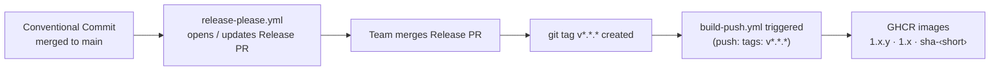

# Release Workflow

This document covers how dineOS manages versioning and releases: the Conventional
Commit format that every merged commit must follow, how release-please turns those
commits into an automated release PR, and how merging that PR creates the `v*.*.*`
git tag that triggers Docker image publishing with semver tags.

A single version in `version.txt` covers the whole monorepo — the .NET backend and
the Next.js frontend are built and shipped together.

All commands are run from the **repo root** unless noted otherwise.

---

## Flow Overview



Commits that are not `feat`, `fix`, `perf`, or `revert` (e.g. `chore`, `ci`,
`refactor`) appear in the git history but are hidden in the CHANGELOG and do not
bump the version on their own.

---

## Conventional Commits

Every commit merged to `main` must follow the
[Conventional Commits](https://www.conventionalcommits.org/) specification.
The `commitlint.yml` CI workflow enforces this on every pull request — both the
individual commits and the PR title (which GitHub uses as the squash-merge message).

### Format

```
<type>(<scope>): <short summary in present tense, lowercase, no period>
```

### Types and version bump rules

| Type | Visible in CHANGELOG | Version bump |
|------|---------------------|--------------|
| `feat` | ✅ Features | minor (`0.x.0`) |
| `fix` | ✅ Bug Fixes | patch (`0.0.x`) |
| `perf` | ✅ Performance | patch |
| `revert` | ✅ Reverts | patch |
| `docs` | ✅ Documentation | — (no bump; appears in CHANGELOG when a releasable commit triggers the release) |
| `chore` | hidden | — (no bump; release-please never opens a release PR for `chore`-only pushes) |
| `refactor` | hidden | — |
| `test` | hidden | — |
| `ci` | hidden | — |
| `build` | hidden | — |
| `style` | hidden | — |
| `feat!` / `fix!` / `BREAKING CHANGE:` footer | ✅ ⚠ BREAKING CHANGES | major (`x.0.0`) |

### Scopes

Scopes are optional but strongly encouraged — they appear as **bold prefixes** in
the CHANGELOG and provide per-area separation without requiring separate sections.

```
feat(frontend): add public signup page
fix(api): return 404 instead of 500 on missing menu item
feat(devops): DO-6 ELK centralized logging stack
fix(ci): use --dry-run=client for helm validation
docs(auth): document Keycloak realm export process
```

### Breaking changes

Append `!` after the type or add a `BREAKING CHANGE:` trailer in the commit body.
release-please always promotes breaking changes to a dedicated `⚠ BREAKING CHANGES`
section at the top of the CHANGELOG, regardless of type.

```
feat(api)!: remove v1 order endpoint — use v2 instead

BREAKING CHANGE: DELETE /api/v1/orders/{id} has been removed.
Migrate callers to DELETE /api/v2/orders/{id}.
```

```
feat(devops)!: require RELEASE_PLEASE_TOKEN for tag-triggered builds
```

### What gets rejected by commitlint

| Bad commit | Problem | Correct form |
|------------|---------|--------------|
| `fix trivy npm error` | missing type prefix | `fix(ci): trivy npm error` |
| `Fix/helm dry run client` | uppercase, slash format | `fix(ci): use --dry-run=client for helm` |
| `DO-5: Prometheus monitoring` | bare task prefix | `feat(devops): DO-5 Prometheus monitoring` |
| `Update verify-compose.ps1` | bare verb, no type | `chore(devops): update verify-compose.ps1` |

---

## Release PR Lifecycle

release-please runs as `.github/workflows/release-please.yml` on every push to
`main`. It reads the commit log since the last release, determines the next
semantic version, and either opens or updates a release PR.

### What the release PR contains

- **Title:** `chore(release): v<next-version>` — itself a valid Conventional Commit
- **Files changed:**
  - `version.txt` — bumped to the new version
  - `CHANGELOG.md` — new section prepended with all releasable commits since the last release, grouped by type and annotated with scopes

The release PR stays open and is continuously updated as more commits land on `main`.
It is never merged automatically — a team member reviews and merges it when ready
to cut a release.

### Merging the release PR

When the release PR is merged:

1. release-please detects the merged PR on the next `main` push.
2. It creates a **git tag** `v<version>` (e.g. `v1.4.0`) and a **GitHub Release**
   whose body is the matching CHANGELOG section.
3. The tag push triggers `build-push.yml` (trigger: `push: tags: v*.*.*`).

---

## Version → Docker Image Tags

`build-push.yml` uses `docker/metadata-action@v5` with these tag rules:

```yaml
type=semver,pattern={{version}}        # → 1.4.0
type=semver,pattern={{major}}.{{minor}} # → 1.4
type=sha,format=short                  # → sha-<7char>  (always present)
```

For the release PR merge to `main` (the commit that becomes the release):

| Trigger | Tags produced |
|---------|--------------|
| Release PR merged to `main` | `main`, `sha-<7char>`, `latest` |
| `v1.4.0` tag created (same commit) | `1.4.0`, `1.4`, `sha-<7char>` |

The `latest` tag is set by the main-branch push (step one). The tag push (step two)
produces the semver tags on the same commit. After both runs complete, `latest`,
`1.4.0`, and `1.4` all reference the same image layers.

The `deploy` job in `build-push.yml` uses the `sha-<7char>` tag as the Helm
`--set *.image.tag` value — it is always present regardless of trigger type.

---

## CHANGELOG Format

`CHANGELOG.md` is generated and owned by release-please. Do not edit it manually.

A generated release section looks like:

```markdown
## [1.4.0](https://github.com/.../compare/v1.3.0...v1.4.0) (2026-06-10)

### ⚠ BREAKING CHANGES

* **api:** remove v1 order endpoint — use v2 instead ([#301](…))

### Features

* **devops:** DO-13 semantic versioning and automated changelogs ([#299](…))
* **frontend:** add public signup page with Stripe redirect ([#212](…))
* **backend:** auto-provision tenant owner on SubscriptionCreated ([#211](…))

### Bug Fixes

* **ci:** use --dry-run=client for helm validation ([#235](…))
* **devops:** address DO-2 code review findings ([#232](…))

### Documentation

* **auth:** document Keycloak realm export process ([#298](…))
```

Hidden types (`chore`, `ci`, `refactor`, `test`, `build`, `style`) do not appear.
Breaking changes always appear first, above Features, regardless of commit type.

---

## Required Secrets

No additional secrets are required beyond what `build-push.yml` already uses.
`release-please.yml` uses the automatic `GITHUB_TOKEN` for both PR management and
tag creation.

> **Note:** Tags created via `GITHUB_TOKEN` trigger downstream workflows (including
> `build-push.yml`) because GitHub exempts tag-push events from the recursion
> prevention that applies to commit pushes. If your organisation's GitHub Actions
> settings prevent this, set `token: ${{ secrets.RELEASE_PLEASE_TOKEN }}` in
> `.github/workflows/release-please.yml` and create a PAT with `repo` and
> `workflow` scopes.

---

## Local Verification

Check that a commit message is valid before pushing:

```bash
# Lint the last commit
npx commitlint --from=HEAD~1 --verbose

# Lint the last N commits
npx commitlint --from=HEAD~3 --verbose

# Lint a message without committing
echo "feat(frontend): add order status badge" | npx commitlint --verbose
```

---

## Troubleshooting

### commitlint fails on the release PR itself

The release PR title is `chore(release): v1.4.0`, which is valid Conventional
Commits syntax. If commitlint rejects it, confirm `chore` is not in a custom
`ignores` list in `commitlint.config.js`.

### release-please opens no PR after a push to main

release-please only opens a release PR when at least one commit since the last
release contains a visible type (`feat`, `fix`, `perf`, `revert`, `docs`).
A series of `chore` or `ci` commits alone will not trigger a PR.

### build-push.yml does not run after the tag is created

Verify the tag was created with the `v` prefix (e.g. `v1.4.0`, not `1.4.0`).
The `build-push.yml` trigger is `tags: 'v*.*.*'` — tags without the prefix do not
match. Check the **Actions** tab; if no run appears, the tag may have been created
by a workflow using `GITHUB_TOKEN` in an organisation that has blocked this
(see [Required Secrets](#required-secrets)).
