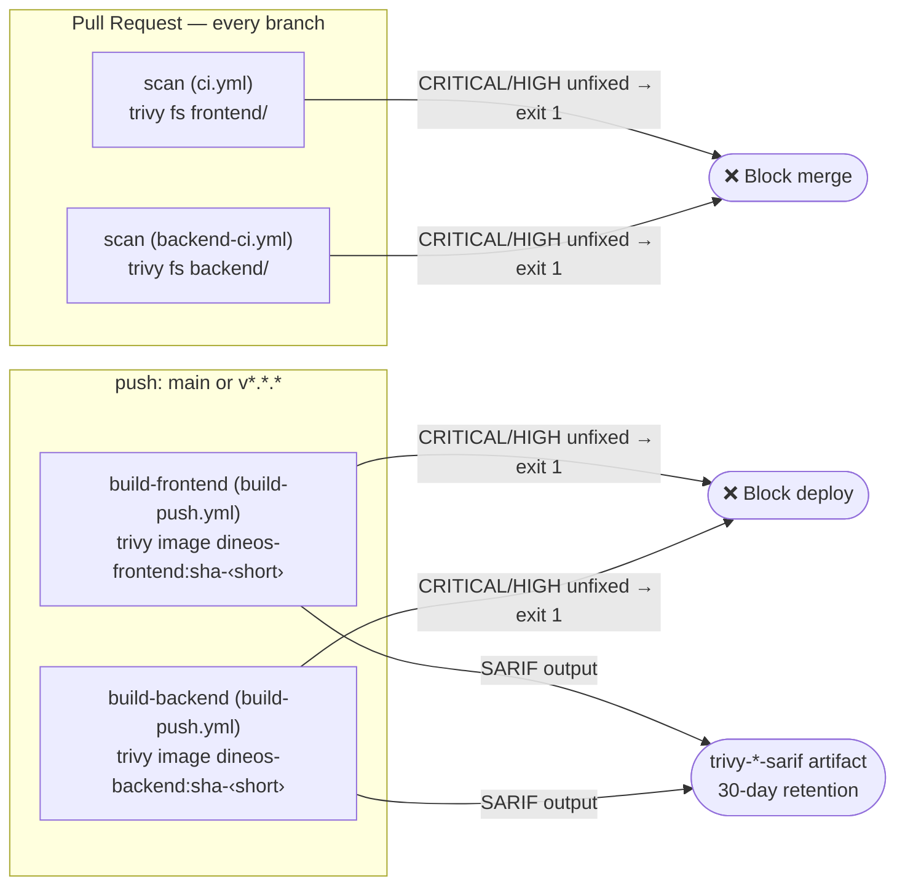

# Container Security

This document covers dineOS container image hardening and vulnerability scanning:
the requirements each built image must meet, how Trivy enforces those requirements
in CI on every pull request and every image build, and how to reproduce scans
locally or manage justified exceptions.

All commands are run from the **repo root** unless noted otherwise.

---

## Scanning Overview

Two types of Trivy scan run automatically in CI:



### Scan types compared

| | Filesystem scan (`trivy fs`) | Image scan (`trivy image`) |
|---|---|---|
| **When** | Every PR and push | After GHCR push on `main` / `v*.*.*` |
| **What it inspects** | Dependency manifests — `package-lock.json`, `.csproj`, NuGet lock files — in the source tree | The full image layer stack: OS packages (`apk`), language packages, and bundled artefacts |
| **Catches** | Vulnerable npm or NuGet packages before a build starts | Everything the fs scan catches, plus OS-level CVEs from the base image |
| **Gate** | Blocks merge | Blocks deploy — the image is already pushed but the `deploy` job will not run |
| **SARIF output** | No — findings appear in the job log | Yes — `trivy-frontend-sarif` / `trivy-backend-sarif` artifact, 30-day retention |

---

## Image Hardening

Both runtime images are built to the following criteria. All criteria were verified
against the committed Dockerfiles on 2026-05-28; see [Audit results](#audit-results)
for the live verification output.

### Minimal runtime base (Alpine)

| Image | Build stage (discarded) | Runtime stage |
|---|---|---|
| Backend | `mcr.microsoft.com/dotnet/sdk:10.0` | `mcr.microsoft.com/dotnet/aspnet:10.0-alpine` |
| Frontend | `node:22-alpine` | `node:22-alpine` |

The SDK and full-node build layers are discarded by the multi-stage build. Only the
Alpine-based runtime layer ships. Alpine images carry a much smaller OS package
surface than Debian or Ubuntu variants, which directly reduces the number of
base-image CVEs that Trivy reports against the production image.

Source: `FROM` directives in `backend/src/DineOS.Api/Dockerfile` and `frontend/Dockerfile`.

### Non-root user (UID 1001)

Both Dockerfiles create a dedicated system account before copying any application
files, then switch to it with `USER 1001` immediately before `ENTRYPOINT` / `CMD`.

**Backend** (`backend/src/DineOS.Api/Dockerfile`):

```dockerfile
RUN addgroup -S -g 1001 appgroup \
 && adduser  -S -u 1001 -G appgroup appuser \
 && mkdir -p /app/uploads \
 && chown -R appuser:appgroup /app
...
USER 1001
EXPOSE 8080
ENTRYPOINT ["dotnet", "DineOS.Api.dll"]
```

**Frontend** (`frontend/Dockerfile`):

```dockerfile
RUN addgroup -S -g 1001 nodejs \
 && adduser  -S -u 1001 -G nodejs nextjs
...
USER 1001
EXPOSE 3000
CMD ["node", "server.js"]
```

`-S` creates a system account with no password and no home directory. A fixed
UID/GID 1001 is used rather than a name so that a Kubernetes
`securityContext.runAsUser: 1001` can be applied in the Helm chart without
requiring the container to resolve the username at runtime.

### Explicit ownership via `--chown`

All `COPY` instructions in the runtime stage carry an explicit `--chown` flag so
that copied files are owned by the non-root user from the moment they land in the
image layer — no ownership correction is needed at container start time.

**Backend** (one COPY instruction):

```dockerfile
COPY --from=build --chown=appuser:appgroup /app/publish .
```

**Frontend** (three COPY instructions, all chowned):

```dockerfile
COPY --from=builder --chown=nextjs:nodejs /app/.next/standalone ./
COPY --from=builder --chown=nextjs:nodejs /app/.next/static     ./.next/static
COPY --from=builder --chown=nextjs:nodejs /app/public           ./public
```

The backend additionally runs `chown -R appuser:appgroup /app` in the `RUN` block
to cover the `/app/uploads` directory created at build time.

### Build context isolation (`.dockerignore`)

Three `.dockerignore` files prevent sensitive or irrelevant paths from entering
the build context:

| Category | Pattern | `backend/` | `frontend/` | root |
|---|---|---|---|---|
| Environment secrets | `.env*` (except `.env.example`) | ✅ | ✅ | ✅ |
| VCS metadata | `.git`, `.github` | ✅ | ✅ | ✅ |
| Build artefacts | `**/bin/`, `**/obj/`, `**/node_modules/`, `**/.next/` | ✅ | ✅ | ✅ |
| Test artefacts | `**/coverage/`, `**/test-results/`, `**/playwright-report/` | ✅ | ✅ | ✅ |
| IDE metadata | `.vs/`, `.vscode/`, `.idea/` | ✅ | ✅ | ✅ |
| OS metadata | `.DS_Store`, `Thumbs.db` | ✅ | ✅ | ✅ |

No `.env` file can leak into any image layer through the build context.

### Audit results

Baseline audit performed 2026-05-28 against the committed Dockerfiles.

| Criterion | Backend | Frontend |
|---|---|---|
| Alpine runtime base | ✅ | ✅ |
| Non-root user (UID 1001) | ✅ | ✅ |
| `--chown` on all COPY | ✅ | ✅ |
| Secrets excluded (`.dockerignore`) | ✅ | ✅ |
| Live `id` check confirms non-root | ✅ | ✅ |

**Live `docker run --rm --entrypoint id <image>` output:**

```
# Backend  (243 MB)
uid=1001(appuser) gid=1001(appgroup) groups=1001(appgroup),1001(appgroup)

# Frontend  (313 MB)
uid=1001(nextjs) gid=1001(nodejs) groups=1001(nodejs),1001(nodejs)
```

Image sizes (243 MB backend, 313 MB frontend) serve as the baseline for layer-bloat
regression tracking. A significant size increase on a future build is a signal to
audit what was added.

---

## Trivy Scanning

### PR filesystem scan

Runs as the `scan` job in `ci.yml` (frontend) and `backend-ci.yml` (backend) on
every push and pull request. The job has no `needs` dependency — it runs in
parallel with lint and tests and adds no extra wall-clock time to the pipeline.

The scan inspects dependency manifests for known CVEs. It does not pull or inspect
Docker images; that happens at image build time.

**Reproduce locally:**

```bash
# Install Trivy (macOS / Linux)
brew install aquasecurity/trivy/trivy         # macOS
# or: https://aquasecurity.github.io/trivy/latest/getting-started/installation/

# Frontend — matches ci.yml scan job
trivy fs --severity CRITICAL,HIGH --ignore-unfixed \
  --ignorefile .trivyignore \
  frontend/

# Backend — matches backend-ci.yml scan job
trivy fs --severity CRITICAL,HIGH --ignore-unfixed \
  --ignorefile .trivyignore \
  backend/
```

Exit code 0 means no CRITICAL/HIGH unfixed findings. Exit code 1 means the PR
would be blocked.

### Image build scan

Runs as the `Scan ... image for vulnerabilities` step inside the `build-frontend`
and `build-backend` jobs in `build-push.yml`, immediately after the `Build and push`
step. The image is already pushed to GHCR at this point; Trivy pulls it using the
Docker credentials set by the `Log in to GHCR` step.

The image scan covers everything the filesystem scan does, plus all Alpine OS
packages from the `apk` database. OS-level CVEs introduced by the base image
(`mcr.microsoft.com/dotnet/aspnet:10.0-alpine`, `node:22-alpine`) only appear here.

**Reproduce locally:**

```bash
# Pull the image first (requires GHCR authentication)
docker pull ghcr.io/<owner>/dineos-frontend:sha-<short>
docker pull ghcr.io/<owner>/dineos-backend:sha-<short>

# Frontend image scan — matches build-push.yml scan step
trivy image --severity CRITICAL,HIGH --ignore-unfixed \
  --ignorefile .trivyignore \
  ghcr.io/<owner>/dineos-frontend:sha-<short>

# Backend image scan
trivy image --severity CRITICAL,HIGH --ignore-unfixed \
  --ignorefile .trivyignore \
  ghcr.io/<owner>/dineos-backend:sha-<short>
```

To find the `sha-<short>` value for the last `main` push:

```bash
git log -1 --format='sha-%h'
```

### Severity threshold and `--ignore-unfixed`

**`--severity CRITICAL,HIGH`** — LOW and MEDIUM CVEs are excluded from the gate.
Blocking on every LOW/MEDIUM finding in a typical Alpine + Node/ASP.NET image
would produce unactionable noise; CRITICAL and HIGH represent vulnerabilities with
realistic exploit paths or significant impact. LOW/MEDIUM findings are visible in
the SARIF artifact (image scan) and in the job log (filesystem scan) for manual
review.

**`--ignore-unfixed`** — Only CVEs that have a fix available upstream are counted
as failures. An unfixed CVE cannot be resolved by upgrading the dependency; it
would only be suppressible via `.trivyignore`. Filtering unfixed CVEs from the gate
prevents builds from being blocked by vulnerabilities the team has no practical
means to resolve, while still surfacing any newly-fixed CVE the moment a fix is
published and the dependency can be upgraded.

### SARIF artifact

The image build scan writes a SARIF file (`trivy-frontend.sarif` /
`trivy-backend.sarif`) before evaluating the exit code. Both files are uploaded as
artifacts regardless of whether the scan passed or failed, so the findings that
blocked the pipeline are always available for review.

**To view findings:**

1. Open the failing **Build & Push** run in GitHub Actions.
2. Scroll to **Artifacts** at the bottom of the run summary.
3. Download `trivy-frontend-sarif` or `trivy-backend-sarif`.
4. Open in [Microsoft SARIF Viewer](https://microsoft.github.io/sarif-web-component/)
   or in VS Code with the **SARIF Viewer** extension (`MS-SarifVSCode.sarif-viewer`).

Artifacts are retained for **30 days**. The filesystem scan (PR) does not produce
a SARIF artifact; findings appear directly in the job log.

---

## `.trivyignore` Policy

### What the file is for

`.trivyignore` at the repo root suppresses specific CVEs from Trivy scan results.
It exists **only for confirmed false positives** — vulnerabilities that have been
reviewed and confirmed to pose no real risk in the dineOS production runtime. It is
not a place to defer remediation of genuine vulnerabilities.

### When an exception is valid

An entry is justified when **all three** of the following are true:

1. The vulnerable code path is provably unreachable in the dineOS runtime (e.g. a
   CLI flag the process never passes, a protocol the service does not expose, a file
   format it does not process).
2. No upstream fix is available yet. (`--ignore-unfixed` already filters fixed CVEs,
   so anything reaching `.trivyignore` must be genuinely unfixable at the time of
   writing.)
3. The risk has been reviewed by a second team member and documented in the entry
   comment.

If a fix is available, **upgrade the dependency** instead of adding an exception.

### Required entry format

```
# CVE-YYYY-NNNNN — <one-line description of the vulnerability>
# Reason:   <why this does not apply to dineOS in production>
#           <cite the upstream advisory or vendor statement if available>
# Scope:    <which image(s) and/or path(s) this applies to>
# Added:    YYYY-MM-DD by <GitHub username>
# Review:   YYYY-MM-DD  (must be ≤ 90 days from Added)
CVE-YYYY-NNNNN exp:YYYY-MM-DD
```

The `exp:YYYY-MM-DD` suffix is parsed natively by Trivy (≥ 0.29). When the review
date passes, Trivy treats the entry as absent — CI fails again on the previously
suppressed CVE, which is the intended reminder signal.

**Field rules:**

| Field | Rule |
|---|---|
| `Reason` | Must cite the specific code path or condition that makes the CVE unreachable. "Low severity" or "upstream hasn't fixed it" are not sufficient on their own. |
| `Scope` | Must name the image(s) affected (`dineos-frontend`, `dineos-backend`, or both) and optionally the package or path. |
| `Added` | ISO date (`YYYY-MM-DD`) and the GitHub username of the person adding the entry. |
| `Review` | ISO date no more than **90 days** after `Added`. This is also the `exp:` date on the CVE line. |

### How to add an entry

1. Run the scan locally to reproduce the finding (commands in the [Trivy scanning](#trivy-scanning) section above).
2. Research the CVE in the upstream advisory (NVD, OSV, or the affected package's changelog).
3. Confirm with a second team member that the exception is justified.
4. Add the comment block + CVE line to `.trivyignore` following the template above.
5. Open a PR. The description must include a link to the upstream advisory and a
   summary of the justification. The PR requires at least one review approval.
6. Set a calendar reminder for the `Review` date.

### Expiry and review process

**Owner:** DevOps team (currently Endriti). Any team member who added an entry is
responsible for tracking its review date.

When CI fails on a previously suppressed CVE after the `exp:` date passes:

| Scenario | Action |
|---|---|
| An upstream fix is now available | Upgrade the dependency and remove the entry from `.trivyignore`. |
| The CVE is still unfixed and the justification still holds | Re-evaluate the risk, update `Review` to a new date (≤ 90 days), and get a second approval on the PR. |
| The justification no longer holds | Remove the exception and treat the CVE as a real finding that must be remediated. |

**Quarterly sweep:** On the first working day of each quarter the DevOps owner runs
a full image scan against the latest production images and audits all active entries,
regardless of whether their `exp:` date has passed. Findings are tracked as a GitHub
issue labeled `security` + `devops`.

---

## See also

- **[CI/CD pipeline](cicd.md)** — workflow diagram, image tagging scheme, required secrets, and production environment configuration
- **[Backend Dockerfile](../../backend/src/DineOS.Api/Dockerfile)** — multi-stage build with runtime hardening
- **[Frontend Dockerfile](../../frontend/Dockerfile)** — multi-stage build with runtime hardening
