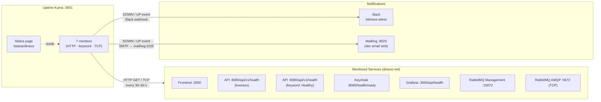

# Uptime Kuma — Synthetic Monitoring & Status Page

This document covers the Uptime Kuma synthetic-monitoring setup for dineOS:
what services are monitored, how alerts are delivered, and how to run the demo
end-to-end locally or enable it in Kubernetes.

Uptime Kuma complements Prometheus and the ELK stack: Prometheus measures
**how** services behave from the inside (error rates, latency, GC), while
Uptime Kuma measures **whether** they are reachable from an external vantage
point.  When Prometheus reports a 5 % error rate, a human still needs to check
that the frontend and API endpoints are actually responding.  Uptime Kuma
removes that manual step by continuously polling every service and publishing
a public status page.

All commands are run from the **repo root** unless noted otherwise.

---

## Architecture



### Component responsibilities

| Component | Role |
|-----------|------|
| **HTTP monitor** | Performs a full HTTP GET and verifies the response code falls in `200–299`. Catches process crashes, failed deployments, and network partitions. |
| **Keyword monitor** | HTTP GET plus body scan for a specific string. Catches `Degraded` health-check states that still return HTTP 200 (e.g. when a .NET health check reports partial failure). |
| **TCP monitor** | Opens a TCP socket and confirms the port accepts connections. Used for the RabbitMQ AMQP port — no HTTP layer to check. |
| **Slack channel** | Incoming-webhook notification on every state change (DOWN and recovery). Reuses the same `SLACK_WEBHOOK_URL` variable as Alertmanager. |
| **SMTP channel** | Email notification via the Mailhog dev mail sink. Zero config for local development; swap credentials in the UI for production. |
| **Status page** | Public read-only dashboard at `/status/dineos` — no login required. Aggregates all monitors and is suitable for sharing with stakeholders. |

---

## Monitor reference

All monitors run inside the `dineos-net` Docker network and poll internal
hostnames, so they are not reachable from outside the Docker environment.

| # | Name | Type | Target | Interval | Retries | Purpose |
|---|------|------|--------|----------|---------|---------|
| 1 | Frontend | HTTP | `http://frontend:3000` | 60 s | 3 | Next.js UI reachable — 200–299 |
| 2 | API – Liveness | HTTP | `http://api:8080/api/v1/health` | 30 s | 3 | API process is alive — 200–299 |
| 3 | API – Readiness (DB) | Keyword | `http://api:8080/api/v1/health` | 30 s | 3 | All health checks pass, including PostgreSQL — body must contain `Healthy` |
| 4 | Keycloak | HTTP | `http://keycloak:8080/health/ready` | 60 s | 3 | Quarkus readiness probe — 200–299 |
| 5 | Grafana | HTTP | `http://grafana:3000/api/health` | 60 s | 3 | Grafana API health endpoint — 200–299 |
| 6 | RabbitMQ – Management | HTTP | `http://rabbitmq:15672` | 60 s | 3 | Management UI responds — 200–299 |
| 7 | RabbitMQ – AMQP | TCP | `rabbitmq:5672` | 30 s | 3 | AMQP broker accepts TCP connections |

### API – Liveness vs API – Readiness (DB)

These two monitors cover different failure modes for the same endpoint:

| Monitor | What it catches |
|---------|----------------|
| **API – Liveness** | HTTP 500 or no response — the process is dead or the runtime is panicking |
| **API – Readiness (DB)** | HTTP 200 with body `{"status":"Degraded",...}` — the process is alive but PostgreSQL is unreachable or the DB health check has timed out |

A .NET health check endpoint can return HTTP 200 even in a `Degraded` state
(depending on `FailureStatus` configuration).  The keyword monitor catches this
case by requiring the string `Healthy` to appear in the response body,
independently of the status code.

Both monitors fire to both notification channels on state change.

---

## Notification channels

### Slack — `#dineos-alerts` (default, id 1)

| Field | Dev / demo value | Production |
|-------|-----------------|------------|
| Type | Slack Incoming Webhook | Slack Incoming Webhook |
| Webhook URL | placeholder (`TXXXXXXXX/BXXXXXXXX/placeholder`) | Real webhook from your Slack App |
| Channel | `#dineos-alerts` | Adjust as needed |
| Is default | Yes — fires for every monitor | Yes |

The webhook URL is **never stored in the repository**.  It is read from the
`SLACK_WEBHOOK_URL` environment variable (the same variable used by
Alertmanager) and passed to `setup/bootstrap.sh` at seed time:

```bash
SLACK_WEBHOOK_URL=https://hooks.slack.com/services/T.../B.../... \
  ./backend/uptime-kuma/setup/bootstrap.sh
```

**To use a real webhook:**

1. Create a Slack App → **Incoming Webhooks** → Activate → copy the URL.
2. Add to `.env`: `SLACK_WEBHOOK_URL=https://hooks.slack.com/services/...`
3. Update the channel in the Kuma UI:
   **Settings → Notifications → Slack – #dineos-alerts → Edit → Test**.

### Email / SMTP — Mailhog (id 2)

| Field | Dev / demo value | Production |
|-------|-----------------|------------|
| Type | SMTP | SMTP |
| Hostname | `mailhog` | Your relay (e.g. `smtp.sendgrid.net`) |
| Port | `1025` | `587` (STARTTLS) or `465` (TLS) |
| Security | None | `STARTTLS` or `TLS` |
| Username | _(empty)_ | API key / SMTP username |
| Password | _(empty)_ | API key / SMTP password — **never commit** |
| From | `uptime-kuma@dineos.local` | A verified sender address |
| To | `ops@dineos.local` | Real recipient; set `UPTIME_KUMA_SMTP_TO` |

Mailhog catches all outbound email locally.  Alert emails appear at
`http://localhost:8025` — no further setup needed for development.

**To use a real SMTP relay in production:**

1. Edit in the Kuma UI:
   **Settings → Notifications → Email – Mailhog (SMTP) → Edit**.
2. Update hostname, port, security, username, and password.
3. Click **Test** to verify delivery.
4. Do not commit credentials — configure them in the live instance only.

---

## Ports and environment variables

| Variable | Default | File | Purpose |
|----------|---------|------|---------|
| `UPTIME_KUMA_PORT` | `3001` | `.env.example` | Host port mapped to Kuma's internal port 3001 |
| `SLACK_WEBHOOK_URL` | placeholder | `.env.example` | Incoming-webhook URL — shared with Alertmanager |
| `UPTIME_KUMA_SMTP_TO` | `ops@dineos.local` | `.env.example` | Alert email recipient for the SMTP channel |
| `KUMA_ADMIN_USER` | `admin` | bootstrap only | Admin username passed to `bootstrap.sh` |
| `KUMA_ADMIN_PASSWORD` | `admin` | bootstrap only | Admin password passed to `bootstrap.sh` |

| Service | Host port | Internal port | UI |
|---------|-----------|---------------|----|
| Uptime Kuma | `${UPTIME_KUMA_PORT:-3001}` | 3001 | `http://localhost:3001` |
| Status page | same | same | `http://localhost:3001/status/dineos` |
| Alert emails (Mailhog) | `${MAILHOG_UI_PORT:-8025}` | 8025 | `http://localhost:8025` |

---

## Local demo

### Prerequisites

| Tool | Purpose |
|------|---------|
| Docker + Docker Compose | run the full stack |
| `bash` | bootstrap and demo scripts |
| `curl` | healthcheck calls |
| Node.js 20+ | JSON parsing in demo script |

### 1. Start the uptime profile

```bash
docker compose up -d                          # core stack
docker compose --profile uptime up -d         # add Uptime Kuma
```

Wait ~15 s for the Kuma container to become healthy:

```bash
docker compose ps uptime-kuma
```

### 2. Bootstrap monitors and notification channels

```bash
./backend/uptime-kuma/setup/bootstrap.sh
```

The script:
1. Creates the admin account (no-op if already configured)
2. Creates the Slack notification channel (reads `SLACK_WEBHOOK_URL`)
3. Creates the SMTP/Mailhog notification channel
4. Creates all 7 monitors via the REST API

Pass a real Slack webhook to wire live alerts:

```bash
SLACK_WEBHOOK_URL=https://hooks.slack.com/services/... \
  ./backend/uptime-kuma/setup/bootstrap.sh
```

### 3. Import the status page and link notifications

The bootstrap script creates monitors and channels but cannot create the status
page or link monitors to channels via the REST API (Socket.IO only in Kuma 1.x).
Complete the setup by importing the backup:

1. Open `http://localhost:3001`
2. Complete the first-login wizard (username: `admin`, password: `admin`).
3. **Settings → Backup → Import** → select `backend/uptime-kuma/kuma-backup.json`
4. Click **Import**.

The import creates the **dineOS Services** status page and wires all 7 monitors
to both notification channels.

### 4. Verify

| URL | What you see |
|-----|-------------|
| `http://localhost:3001` | Kuma dashboard — all monitors should show green within 60 s |
| `http://localhost:3001/status/dineos` | Public status page — all services UP |
| `http://localhost:8025` | Mailhog — no unread alerts yet |
| `http://localhost:3001/settings/notifications` | Both channels listed |

---

## Demo script

The demo script proves the full monitoring pipeline end-to-end:

1. Stops the API container
2. Waits for Kuma to detect the outage and fire a DOWN notification email
3. Confirms the email arrives in Mailhog
4. Restarts the API
5. Waits for the recovery notification email
6. Reports PASS or PARTIAL with a summary

```bash
bash scripts/demo-uptime-kuma.sh
```

Expected output (abbreviated):

```
────────────────────────────────────────────────────
 DineOS — Uptime Kuma DOWN/UP demo
 Kuma   : http://localhost:3001
 Mailhog: http://localhost:8025
────────────────────────────────────────────────────

▶  1/6  Verify Kuma and Mailhog are reachable
   ✓  Uptime Kuma http://localhost:3001/api/entry-page → up
   ✓  Mailhog     http://localhost:8025/api/v2/messages → up

▶  2/6  Authenticate with Kuma
   ✓  Token obtained for 'admin'
   ✓  Found monitor 'API – Liveness' (id 2)

▶  3/6  Baseline — confirm API is UP
   ✓  API container is running
   ✓  Kuma: API – Liveness = UP
   →  Mailhog baseline: 0 messages

▶  4/6  Stop API → wait 150 s for DOWN notification
   ✓  docker compose stop api — done
     5s — waiting for Kuma DOWN notification...
    35s — waiting for Kuma DOWN notification...
   ✓  DOWN notification received after 65s
   →  New Mailhog messages:
      [🔴 Down] API – Liveness

▶  5/6  Restart API → wait 90 s for recovery notification
   ✓  docker compose start api — done
     5s — waiting for recovery notification...
   ✓  Recovery notification received after 45s
   →  New Mailhog messages:
      [✅ Up] API – Liveness

▶  6/6  Summary
────────────────────────────────────────────────────
   Kuma          : UP
   Mailhog       : UP
   API pre-state : RUNNING
   DOWN alert    : fired after 65s ✓
   Recovery alert: fired after 45s ✓
────────────────────────────────────────────────────
 PASS — DOWN and recovery notifications both arrived.
   The Uptime Kuma → SMTP → Mailhog pipeline is working.
```

**Timing note:** The API – Liveness monitor polls every 30 s with 3 retries.
In the worst case, DOWN detection takes 30 s × 3 = 90 s, then email delivery
adds a few seconds. The script allows 150 s to be safe.

---

## Export / backup

`backend/uptime-kuma/kuma-backup.json` is the canonical source of truth for
monitors, notification channels, and the status page layout.  After any changes
in the Kuma UI, export a fresh backup to keep the repo in sync:

1. **Settings → Backup → Export**
2. Save the downloaded JSON as `backend/uptime-kuma/kuma-backup.json`.
3. Before committing, verify no real secrets are present:

```bash
# Should print only the placeholder — not a real URL
grep -o '"webhookURL":"[^"]*"' backend/uptime-kuma/kuma-backup.json
```

4. Commit the updated file.

The Slack channel in the committed backup always stores the placeholder webhook
URL (`TXXXXXXXX/BXXXXXXXX/placeholder`).  Real webhook URLs live only in `.env`
(git-ignored) and in the live Kuma instance.

---

## Enabling in Kubernetes

The Helm chart ships the Uptime Kuma templates disabled by default.

### Enable

```bash
helm upgrade --install dineos deploy/helm/dineos \
  --set observability.uptimeKuma.enabled=true
```

This renders:
- `<release>-uptime-kuma-data` PersistentVolumeClaim (1 Gi, default StorageClass)
- `<release>-uptime-kuma` Deployment (1 replica, `louislam/uptime-kuma:1`)
- `<release>-uptime-kuma` ClusterIP Service (port 3001)

### Provide the Slack webhook secret

Create the Secret before or at install time (same pattern as Alertmanager):

```bash
kubectl create secret generic kuma-slack \
  --from-literal=url=https://hooks.slack.com/services/YOUR/WEBHOOK/URL \
  -n dineos
```

Reference it in the release:

```bash
helm upgrade dineos deploy/helm/dineos \
  --set observability.uptimeKuma.enabled=true \
  --set observability.uptimeKuma.slackWebhookSecretName=kuma-slack
```

The Deployment injects `SLACK_WEBHOOK_URL` as an environment variable so the
bootstrap script can read it without inlining credentials.

### Seed monitors after deployment

Once the pod is running, port-forward and run the bootstrap script:

```bash
kubectl port-forward svc/<release>-uptime-kuma 3001:3001 -n dineos &

KUMA_URL=http://localhost:3001 \
SLACK_WEBHOOK_URL=$(kubectl get secret kuma-slack -n dineos \
  -o jsonpath='{.data.url}' | base64 -d) \
  ./backend/uptime-kuma/setup/bootstrap.sh
```

Then import `kuma-backup.json` via the UI as described in the Local Demo section.

### Expose via Ingress

```bash
helm upgrade dineos deploy/helm/dineos \
  --set observability.uptimeKuma.enabled=true \
  --set observability.uptimeKuma.ingress.enabled=true \
  --set observability.uptimeKuma.ingress.host=uptime.dineos.io \
  --set observability.uptimeKuma.ingress.clusterIssuer=letsencrypt-prod
```

The status page is then publicly accessible at
`https://uptime.dineos.io/status/dineos` (no login required).

### Disable persistence (ephemeral clusters)

For local clusters (minikube, kind) where a StorageClass may not be available:

```bash
helm upgrade dineos deploy/helm/dineos \
  --set observability.uptimeKuma.enabled=true \
  --set observability.uptimeKuma.persistence.enabled=false
```

All Kuma state (monitor history, configuration, notification credentials) is
stored in an `emptyDir` volume and is lost on pod restart.  Suitable for
development clusters only.

### Verify the deployment

```bash
# Port-forward and open the Kuma dashboard
kubectl port-forward svc/<release>-uptime-kuma 3001:3001 -n dineos
# → open http://localhost:3001

# Status page (public — no auth)
# → open http://localhost:3001/status/dineos
```

---

## See also

- **[Observability — Prometheus, Alertmanager & Grafana](observability.md)** —
  metric-based alerting, SLO dashboards, and the `demo-alert.sh` pipeline demo.
  Uptime Kuma catches black-box availability failures; Prometheus catches
  internal degradation before it reaches the load balancer.
- **[ELK centralized logging](elk.md)** — full-text log search and Nginx access
  analytics.  When an Uptime Kuma alert fires, the first diagnostic step is
  usually to open Kibana and search by `CorrelationId` for the failing requests.
